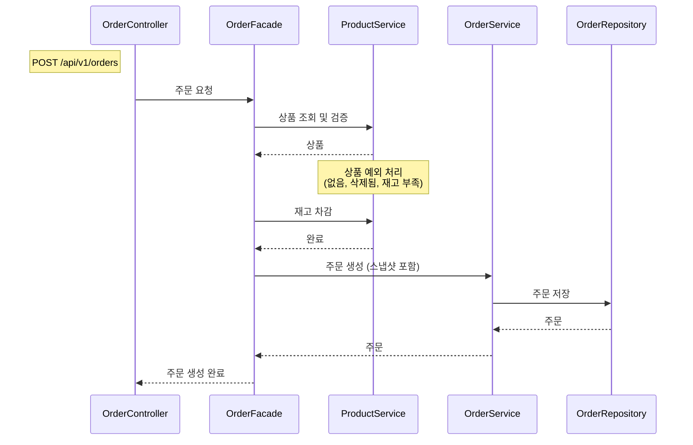
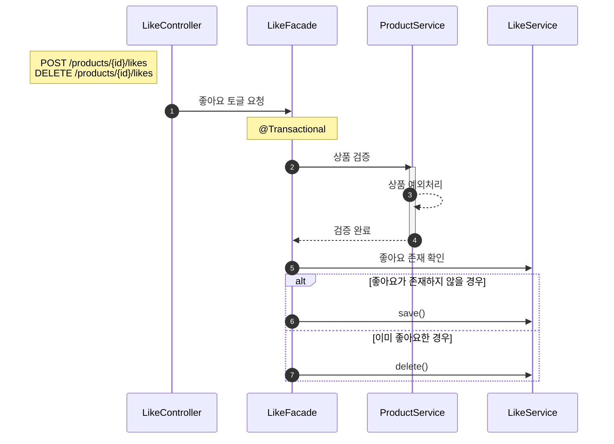
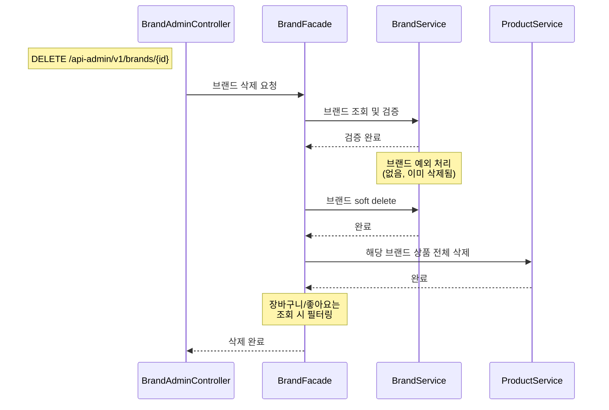

##  주문 요청

### 왜 이 다이어그램이 필요한가

주문은 이 서비스에서 가장 복잡한 흐름입니다.
**Product 도메인 (상품 검증 + 재고 차감) + Order 도메인 (주문 생성 + 스냅샷)**을 조율해야 하므로 Facade가 필요합니다.
이 다이어그램으로 **트랜잭션 경계**와 **도메인 간 협력 구조**를 검증합니다.

### 다이어그램

---

## 좋아요 등록/취소

### 왜 이 다이어그램이 필요한가

좋아요는 **Product 검증 + Like 등록/취소**를 조율해야 하므로 Facade가 필요합니다.
POST/DELETE 엔드포인트는 분리하되, **내부적으로 같은 toggleLike 메서드**를 호출합니다.
이 다이어그램으로 **상품 검증 후 Facade의 토글 분기**를 검증합니다.

### 다이어그램

---

## 브랜드 삭제 (연쇄 처리)

### 왜 이 다이어그램이 필요한가

브랜드 삭제는 **Brand 삭제 + Product 연쇄 삭제**를 조율해야 하므로 Facade가 필요합니다.
단일 엔티티 삭제가 아니라, **브랜드 → 해당 브랜드의 상품 전체**를 연쇄적으로 soft delete 해야 합니다.
이 다이어그램으로 **연쇄 삭제의 범위와 순서**를 검증합니다.

### 다이어그램

