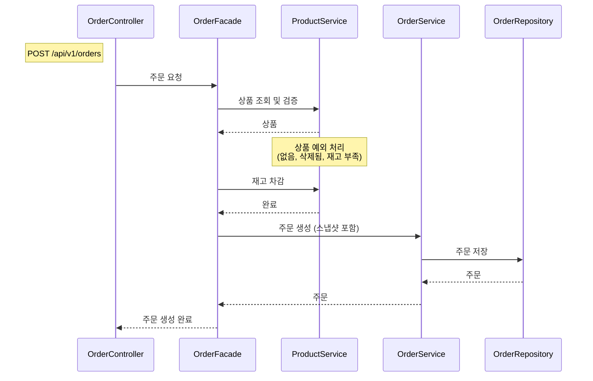
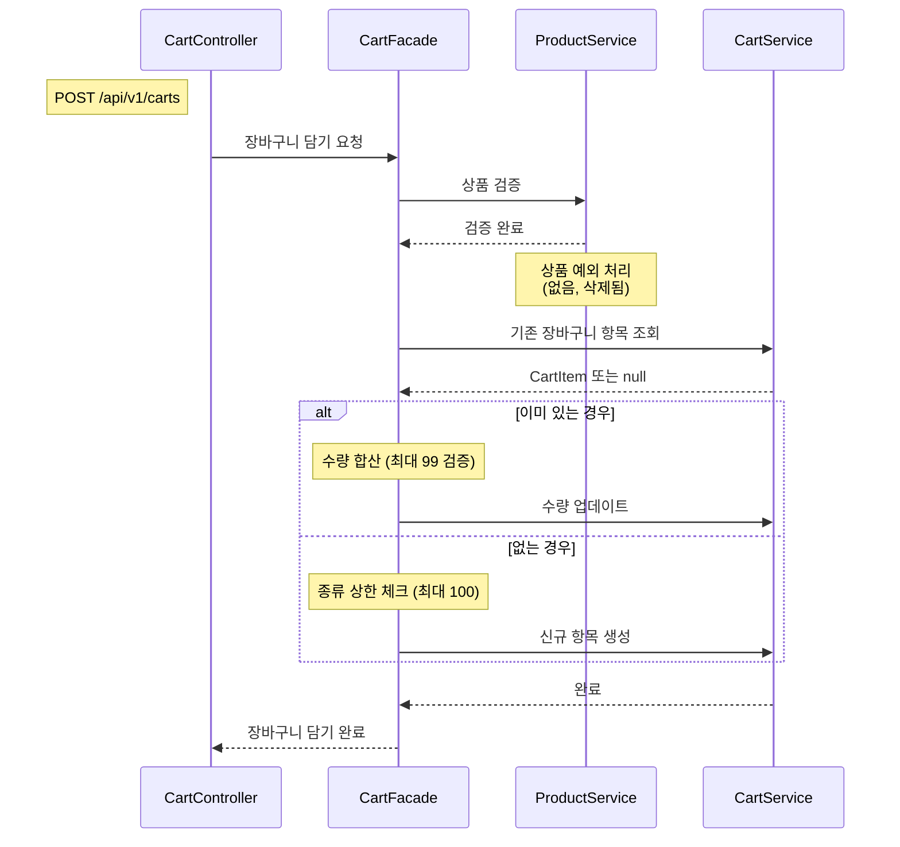
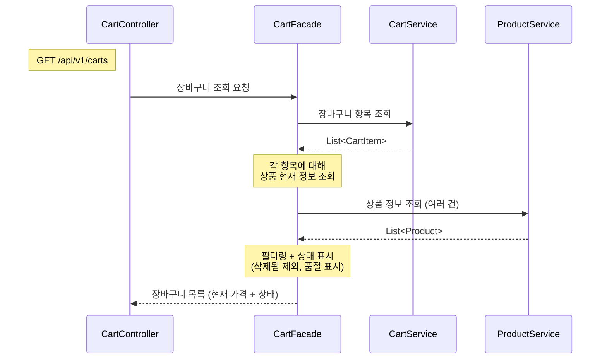
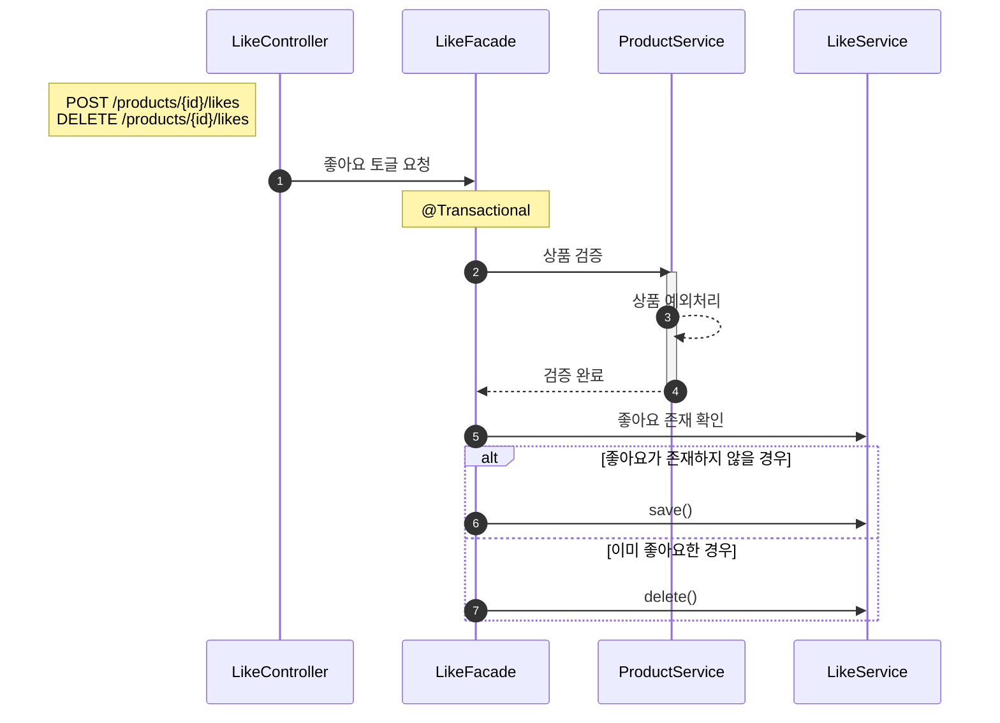
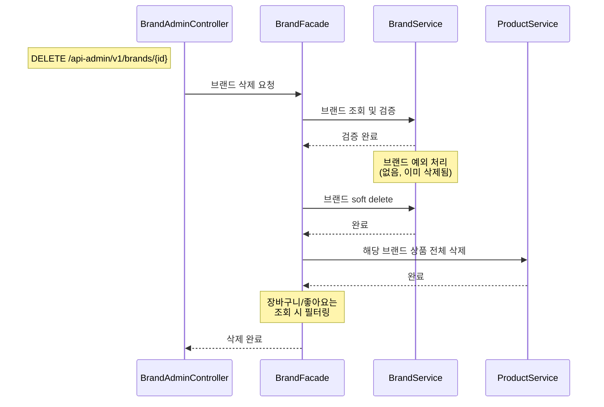

# 02. 시퀀스 다이어그램

> 핵심 유스케이스의 객체 간 협력 구조를 시퀀스 다이어그램으로 표현합니다.
> 책임 분리, 호출 순서, 트랜잭션 경계를 검증하는 것이 목적입니다.

---

## 다이어그램 작성 원칙

1. **User/Admin 제거**: 회원/비회원/관리자 구분은 중요하지만, 다이어그램 복잡성을 늘리므로 제거
2. **구체적 메서드 시그니처 제거**: "주문 요청", "상품 검증" 같이 의도를 전달하는 수준으로 표현
3. **Loop 제거**: 비즈니스 규칙상 N개 처리가 당연한 경우 Loop 표기 생략
4. **Facade 선택적 사용**: 여러 도메인 조율이 필요한 유스케이스만 Facade 사용. 단일 도메인은 Controller → Service 직행

---

## 다이어그램 선정 기준

시퀀스 다이어그램은 **협력이 복잡하고 책임 분리가 중요한 흐름**에서 가치가 있습니다.
단순 CRUD(브랜드 등록, 상품 수정 등)는 협력 구조가 자명하므로 생략했습니다.

| 선정 | 유스케이스 | 선정 이유 |
|------|----------|----------|
| O | 주문 요청 | Product + Order 도메인 협력. 재고 확인→차감→스냅샷→주문 생성 |
| O | 장바구니 담기 | Product + Cart 도메인 협력. 조건 분기 (신규 vs 기존 상품 합산) |
| O | 장바구니 조회 | Product + Cart 도메인 협력. 필터링 로직 (soft delete + 품절 표시) |
| O | 좋아요 등록/취소 | Product + Like 도메인 협력. 상품 검증 + 토글 (존재 여부에 따라 등록/취소) |
| O | 브랜드 삭제 | Brand + Product 도메인 협력. 연쇄 처리 (브랜드→상품 soft delete) |
| X | 브랜드 등록/수정 | 단일 도메인 CRUD. 시퀀스 가치 낮음 |
| X | 상품 목록 조회 | 단일 도메인 조회. 정렬/페이지네이션은 쿼리 레벨 |
| X | 주문 조회 | 단일 도메인 조회. 스냅샷 반환만 |

---

## 1. 주문 요청

### 왜 이 다이어그램이 필요한가

주문은 이 서비스에서 가장 복잡한 흐름입니다.
**Product 도메인 (상품 검증 + 재고 차감) + Order 도메인 (주문 생성 + 스냅샷)**을 조율해야 하므로 Facade가 필요합니다.
이 다이어그램으로 **트랜잭션 경계**와 **도메인 간 협력 구조**를 검증합니다.

### 다이어그램

### 이 다이어그램에서 봐야 할 포인트

- **OrderFacade가 ProductService와 OrderService를 조율**합니다. 두 도메인 서비스는 서로를 모릅니다.
- 상품 검증, 재고 차감은 **ProductService의 책임**. OrderService는 주문 생성만 책임집니다.
- OrderItem 스냅샷은 주문 생성 시점에 Product 정보를 복사하여 저장합니다.
- 트랜잭션은 **OrderFacade에서 관리**. 전체 흐름이 하나의 트랜잭션으로 묶입니다.

---

## 2. 장바구니 담기

### 왜 이 다이어그램이 필요한가

장바구니 담기는 **Product 검증 + Cart 저장/합산**을 조율해야 하므로 Facade가 필요합니다.
**같은 상품이 이미 있으면 수량을 합산**하는 조건 분기가 있습니다.
이 다이어그램으로 **두 갈래 흐름**과 **도메인 간 협력**을 검증합니다.

### 다이어그램

### 이 다이어그램에서 봐야 할 포인트

- **CartFacade가 ProductService와 CartService를 조율**합니다.
- 상품 검증은 ProductService, 장바구니 저장/합산은 CartService 책임입니다.
- **두 갈래 분기**: 이미 담긴 상품이면 수량 합산, 아니면 신규 생성.
- 재고는 확인하지 않습니다 (주문 시점에 확인).

---

## 3. 장바구니 조회

### 왜 이 다이어그램이 필요한가

장바구니 조회는 **Cart 목록 + Product 현재 상태(가격, 재고, 삭제 여부)**를 조합해야 하므로 Facade가 필요합니다.
**삭제된 상품/브랜드 필터링 + 품절 상태 표시**라는 비즈니스 로직이 있습니다.
이 다이어그램으로 **조회 시 필터링의 책임 위치**를 검증합니다.

### 다이어그램

### 이 다이어그램에서 봐야 할 포인트

- **CartFacade가 CartService와 ProductService를 조율**합니다.
- 장바구니 항목을 먼저 조회한 후, **각 항목의 상품 현재 상태를 확인**합니다.
- 삭제된 상품은 제외, 품절(stock=0)은 상태 표시, 정상은 현재 가격과 함께 반환.
- 가격은 장바구니에 저장된 것이 아니라 **현재 상품 가격**을 사용합니다.

---

## 4. 좋아요 등록/취소

### 왜 이 다이어그램이 필요한가

좋아요는 **Product 검증 + Like 등록/취소**를 조율해야 하므로 Facade가 필요합니다.
POST/DELETE 엔드포인트는 분리하되, **내부적으로 같은 toggleLike 메서드**를 호출합니다.
이 다이어그램으로 **상품 검증 후 Facade의 토글 분기**를 검증합니다.

### 다이어그램

### 이 다이어그램에서 봐야 할 포인트

- **LikeFacade가 ProductService와 LikeService를 조율**합니다.
- **POST/DELETE 두 엔드포인트 모두 같은 Facade 메서드(toggleLike)를 호출**합니다.
- **상품 검증은 항상 수행**합니다. 삭제된 상품에 대한 좋아요 조작을 방지합니다.
- **분기(exists → save/delete)는 Facade가 담당**합니다. LikeService는 단순 CRUD만 수행합니다.
- 좋아요 수(COUNT)는 이 흐름에서 관리하지 않습니다. 조회 시 COUNT 쿼리로 산출.

---

## 5. 브랜드 삭제 (연쇄 처리)

### 왜 이 다이어그램이 필요한가

브랜드 삭제는 **Brand 삭제 + Product 연쇄 삭제**를 조율해야 하므로 Facade가 필요합니다.
단일 엔티티 삭제가 아니라, **브랜드 → 해당 브랜드의 상품 전체**를 연쇄적으로 soft delete 해야 합니다.
이 다이어그램으로 **연쇄 삭제의 범위와 순서**를 검증합니다.

### 다이어그램

### 이 다이어그램에서 봐야 할 포인트

- **BrandFacade가 BrandService와 ProductService를 조율**합니다.
- 브랜드 soft delete 후, **같은 트랜잭션 안에서** 해당 브랜드의 상품도 soft delete.
- 장바구니/좋아요는 **이 트랜잭션에서 건드리지 않습니다**. 조회 시 필터링.
- ProductService를 통해 상품 삭제를 처리하므로 도메인 경계가 보존됩니다.

---

## 6. 개선 검토 리스트

현재 Facade → Service → Repository 구조로 작성했습니다.
아래는 **시퀀스 다이어그램을 수정하면서 검토하면 좋을 포인트**입니다.

### 책임 분리 관점

| # | 대상 | 현재 | 검토 포인트 |
|---|------|------|-----------|
| 1 | **주문 - 재고 차감** | ProductService가 재고 차감 처리 | `Product.decreaseStock(quantity)` 도메인 메서드로 추출하면 재고 부족 검증까지 엔티티에 캡슐화 가능 |
| 2 | **주문 - 스냅샷 생성** | OrderFacade 또는 OrderService가 스냅샷 조립 | `OrderItem.createSnapshot(product, quantity)` 정적 팩토리 메서드로 분리하면 스냅샷 대상 필드를 OrderItem이 결정 |
| 3 | **장바구니 담기 - 수량 합산** | CartFacade에서 수량 합산 로직 처리 | `CartItem.addQuantity(quantity)` 도메인 메서드로 검증(최대 99)까지 캡슐화 |
| 4 | **장바구니 조회 - 필터링** | CartFacade에서 필터링 | 쿼리 레벨(JOIN + WHERE deleted_at IS NULL)로 필터링하면 N+1 문제 방지 가능. Facade 레벨 vs 쿼리 레벨 선택 |
| 5 | **상품 검증 로직** | ProductService에 여러 검증 메서드 분산 | Product 엔티티에 `isAvailable()`, `hasStock(quantity)` 같은 도메인 메서드로 캡슐화 검토 |

### 네이밍 관점

| # | 현재 | 검토 포인트 |
|---|------|-----------|
| 6 | `OrderFacade` | 주문 생성만 담당. 주문 조회는 Controller → OrderService 직행. 현재는 문제없음 |
| 7 | `CartFacade` | 담기/조회 담당. 수량 변경/삭제는 Controller → CartService 직행. 현재는 문제없음 |
| 8 | `ProductService` | 상품 CRUD + 검증. 기능이 많아지면 ProductQueryService, ProductCommandService 분리 검토 |

### 구조 관점

| # | 대상 | 검토 포인트 |
|---|------|-----------|
| 9 | **트랜잭션 관리 위치** | 현재 Facade에서 @Transactional 관리. 각 도메인 서비스는 트랜잭션 없이 비즈니스 로직만 담당. 이 구조가 깔끔함 |
| 10 | **장바구니 조회 N+1** | 현재 CartItem 조회 후 Product를 개별 조회. IN 쿼리로 한 번에 가져오는 방식 검토 |
| 11 | **Facade 비대화** | 현재 각 Facade는 1~2개 유스케이스만 담당. 기능 추가 시 유스케이스별 Facade 분리 검토 (CreateOrderFacade, CancelOrderFacade 등) |

---

## Checklist

- [x] 시퀀스 다이어그램이 최소 2개 이상 포함되어 있는가? (5개)
- [x] 시퀀스 다이어그램에서 책임 객체가 드러나는가?
- [x] Facade를 통한 도메인 간 협력 구조가 표현되어 있는가?
- [x] Mermaid 기반으로 작성되었는가?
- [x] 각 다이어그램에 "왜 필요한가"와 "봐야 할 포인트"가 포함되어 있는가?
- [x] 개선 검토 리스트가 포함되어 있는가?
