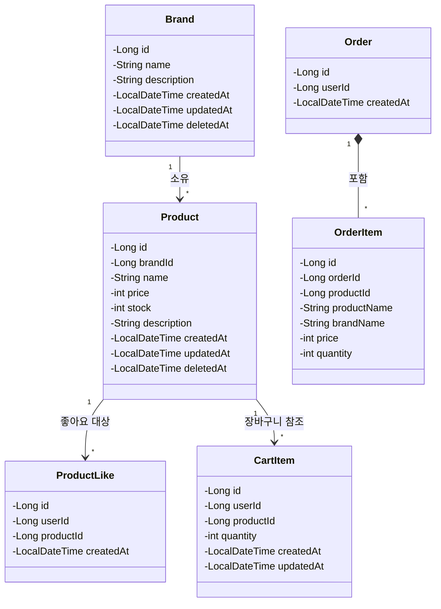
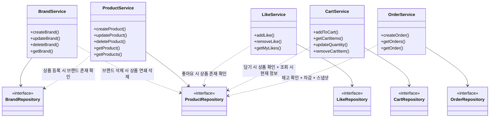

# 03. 클래스 다이어그램

> 도메인 객체의 책임, 관계, 의존 방향을 클래스 다이어그램으로 표현합니다.
> 엔티티의 필드/메서드 설계와 도메인 간 결합 구조를 검증하는 것이 목적입니다.

---

## 다이어그램 선정 기준

클래스 다이어그램은 **도메인 책임과 의존 방향이 중요한 구조**에서 가치가 있습니다.
단순 DTO나 Controller는 구조가 자명하므로 생략했습니다.

| 선정 | 대상 | 선정 이유 |
|------|------|----------|
| O | 도메인 엔티티 전체 관계도 | 엔티티 간 관계, 필드 구성, 책임 분배를 한눈에 확인 |
| O | 서비스 레이어 의존 구조 | 서비스 간 의존 방향, 크로스 도메인 호출 확인 |
| X | Controller 클래스 | 요청 라우팅만 담당. 구조 자명 |
| X | DTO / Request / Response | 필드 나열 수준. 클래스 다이어그램 가치 낮음 |
| X | Repository 인터페이스 | Spring Data JPA 표준 구조. 메서드 시그니처는 ERD에서 확인 |

---

## 1. 도메인 엔티티 관계도

### 왜 이 다이어그램이 필요한가

이 프로젝트에는 5개 핵심 도메인(Brand, Product, ProductLike, Cart, Order)이 있습니다.
엔티티 간 관계와 각 엔티티가 가진 필드를 한눈에 보면서
**책임이 적절히 분배되었는지**, **의존 방향이 올바른지** 검증합니다.

### 다이어그램

### 이 다이어그램에서 봐야 할 포인트

- **Product**가 가장 많은 관계를 맺는 중심 엔티티입니다. ProductLike, CartItem이 Product를 참조합니다.
- **OrderItem**은 Product를 직접 참조하지 않습니다. `productName`, `brandName`, `price`를 **스냅샷으로 복사**합니다. 주문 이후 상품이 변경/삭제되어도 주문 내역은 보존됩니다.
- **CartItem**에는 `price` 필드가 없습니다. 가격은 조회 시 Product의 현재 가격을 사용합니다.
- Brand, Product에 `deletedAt` 필드가 있어 Soft Delete를 지원합니다. ProductLike, CartItem에는 없습니다 (조회 시 필터링).
- 현재 엔티티에 **도메인 메서드가 없습니다**. 모든 로직이 Service에 있는 상태입니다 (개선 검토 리스트 참고).

---

## 2. 서비스 레이어 의존 구조

### 왜 이 다이어그램이 필요한가

시퀀스 다이어그램(02)에서 서비스가 자기 도메인 외의 Repository를 호출하는 부분이 여러 곳 있었습니다.
이 다이어그램으로 **서비스 간 의존 방향**과 **도메인 경계를 넘는 의존**이 어디서 발생하는지 구조적으로 확인합니다.

### 다이어그램

### 이 다이어그램에서 봐야 할 포인트

- **실선(→)**: 자기 도메인 Repository 의존. 당연한 의존.
- **점선(..>)**: 다른 도메인 Repository 의존. **크로스 도메인 호출**. 이 부분이 결합도를 높이는 지점입니다.
- **ProductRepository**가 거의 모든 서비스에서 참조됩니다. Product가 시스템의 핵심 엔티티임을 보여줍니다.
- Cart와 Order 사이에는 **의존이 없습니다**. 설계 결정(5.7)에서 합의한 "서버 도메인 간 독립" 원칙이 지켜지고 있습니다.

---

## 3. 개선 검토 리스트

현재 Controller → Service → Repository 기본 구조로 작성했습니다.
아래는 **클래스 다이어그램을 수정하면서 검토하면 좋을 포인트**입니다.

### 도메인 메서드 관점

| # | 대상 | 현재 | 검토 포인트 |
|---|------|------|-----------|
| 1 | **Product - 재고 차감** | Service에서 `product.stock -= quantity` 처리 | `Product.decreaseStock(quantity)` 도메인 메서드로 추출하면? 재고 부족 검증까지 Product 내부에서 책임지면 비즈니스 규칙이 엔티티에 캡슐화됨 |
| 2 | **Product - 품절 확인** | Service에서 `product.stock == 0` 체크 | `Product.isSoldOut()` 메서드로 추출하면 "품절"의 정의가 바뀌어도 한 곳만 수정 |
| 3 | **Product / Brand - soft delete** | Service에서 `entity.deletedAt = now()` 직접 설정 | `softDelete()`, `isDeleted()` 메서드로 추출하면 삭제 상태 관련 로직이 엔티티에 응집 |
| 4 | **CartItem - 수량 합산** | Service에서 `cartItem.quantity += quantity` 처리 | `CartItem.addQuantity(quantity)` 메서드로 추출. 최대 99 검증까지 캡슐화 |
| 5 | **CartItem - 수량 변경** | Service에서 `cartItem.quantity = newQuantity` 처리 | `CartItem.updateQuantity(quantity)` 메서드로 추출. 1~99 범위 검증 캡슐화 |
| 6 | **OrderItem - 스냅샷 생성** | Service에서 Product 정보를 꺼내 OrderItem 필드에 매핑 | `OrderItem.createSnapshot(product, quantity)` 정적 팩토리 메서드로 분리하면 스냅샷 대상 필드를 OrderItem이 결정 |

### 의존 방향 관점

| # | 대상 | 현재 | 검토 포인트 |
|---|------|------|-----------|
| 7 | **BrandService → ProductRepository** | BrandService가 ProductRepository를 직접 의존 | ProductService를 거치면 도메인 경계가 명확해짐. 하지만 같은 트랜잭션 안에서 처리해야 하므로 직접 호출이 더 단순할 수 있음. 트레이드오프 판단 필요 |
| 8 | **OrderService → ProductRepository** | OrderService가 재고 확인/차감까지 직접 처리 | ProductService의 `decreaseStock(productId, quantity)` 메서드를 통해 호출하면 재고 관련 책임이 ProductService로 모임. 하지만 트랜잭션 범위 관리가 복잡해질 수 있음 |

### JPA 관계 매핑 관점

| # | 대상 | 현재 | 검토 포인트 |
|---|------|------|-----------|
| 9 | **Product ↔ Brand** | Product에 `brandId` (Long) 저장 | `@ManyToOne`으로 Brand 엔티티 직접 참조하면 JOIN으로 한 번에 조회 가능. 단, 양방향 관계는 결합도를 높이므로 단방향 `@ManyToOne`만 고려 |
| 10 | **Order ↔ OrderItem** | OrderItem에 `orderId` (Long) 저장 | 함께 생성/조회되므로 `@OneToMany` + cascade가 자연스러움. 하지만 Order 목록 조회 시 N+1 주의 |
| 11 | **OrderItem - productId** | OrderItem에 `productId`를 단순 Long으로 저장 | 스냅샷 특성상 FK 제약을 걸면 상품 삭제 시 문제. Long 값으로 저장이 적절. FK 없이 "그때 그 상품"의 참조 용도 |

---

## Checklist

- [x] 클래스 다이어그램이 최소 2개 이상 포함되어 있는가? (2개)
- [x] 도메인 엔티티의 필드와 관계가 드러나는가?
- [x] 서비스 레이어의 의존 방향이 표현되어 있는가?
- [x] Mermaid 기반으로 작성되었는가?
- [x] 각 다이어그램에 "왜 필요한가"와 "봐야 할 포인트"가 포함되어 있는가?
- [x] 개선 검토 리스트가 포함되어 있는가?
