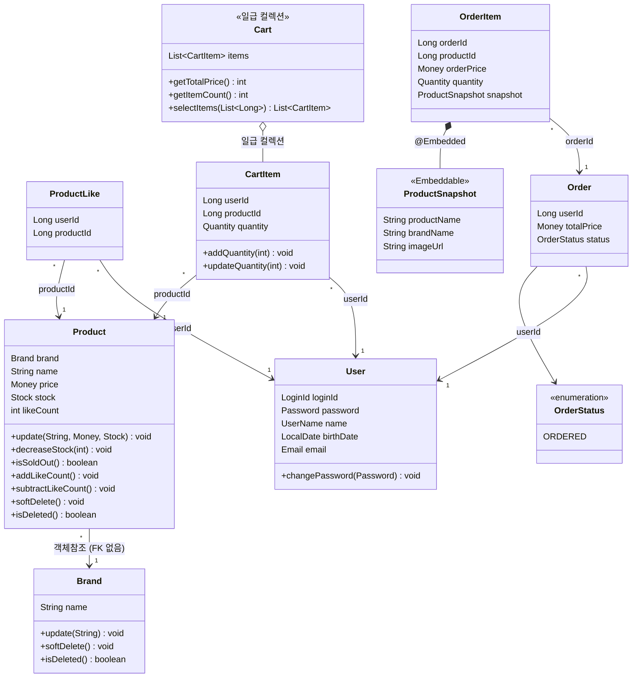

# 클래스 다이어그램

> 도메인 엔티티 중심의 클래스 다이어그램.
> 엔티티의 필드/메서드 설계와 도메인 간 결합 구조를 검증하는 것이 목적입니다.

---

## 다이어그램

---

## Value Object 규칙

| VO | 검증/행위 | 비즈니스 규칙 |
|---|---|---|
| LoginId | validate() | 영문 + 숫자만 허용 |
| Password | validate(birthDate) | 8~16자, 영문대소문자+숫자+특수문자, 생년월일 포함 불가 |
| Password | matches(rawPassword) | BCrypt로 암호화된 값과 원문 비교 |
| UserName | validate() | 이름 포맷 검증 |
| UserName | mask() | 마지막 글자를 `*`로 마스킹 |
| Email | validate() | 이메일 포맷 검증 |
| Money | validate() | 0 이상이어야 함 |
| Stock | validate() | 0 이상이어야 함 |
| Stock | deduct(quantity) | 재고 부족 시 CoreException(BAD_REQUEST) |
| Stock | hasEnough(quantity) | 재고가 요청 수량 이상인지 확인 |
| Quantity | validate() | 1 이상 99 이하 |
| Quantity | add(amount) | 수량 합산, 결과가 99를 초과하면 예외 |

---

## 엔티티별 비즈니스 규칙

| 엔티티 | 메서드 | 비즈니스 규칙 |
|---|---|---|
| User | changePassword(Password) | 새 Password VO로 교체 |
| Brand | update(String) | 브랜드명 변경 |
| Brand | softDelete() / isDeleted() | deleted_at 설정. "삭제"의 정의가 바뀌어도 한 곳만 수정 |
| Product | decreaseStock(int) | 재고 부족 시 CoreException(BAD_REQUEST). Stock VO에 위임 |
| Product | isSoldOut() | stock이 0인지 확인. "품절"의 정의를 캡슐화 |
| Product | addLikeCount() / subtractLikeCount() | 찜 등록/취소 시 likeCount 원자적 증감 |
| Product | softDelete() / isDeleted() | deleted_at 설정. Brand와 동일 패턴 |
| CartItem | addQuantity(int) | 이미 담긴 상품 → 수량 합산. 99 초과 시 예외 |
| CartItem | updateQuantity(int) | 수량 변경. 1~99 범위 검증 |
| Cart | getTotalPrice() | 일급 컬렉션. 장바구니 전체 가격 계산 (Product 현재 가격 기준) |
| Cart | selectItems(List) | 선택한 항목만 추출 (장바구니에서 부분 주문 시) |
| OrderItem | createSnapshot(Product, int) | 정적 팩토리. 주문 시점 Product 정보를 ProductSnapshot으로 복사 |

---

## 관계 정리

| 관계 | 카디널리티 | 참조 방식 | 설명 |
|---|---|---|---|
| Brand → Product | 1 : N | 객체참조 + FK 없음 | `product.getBrand().getName()` 접근. DB에 FK 제약조건 없음 |
| User → ProductLike | 1 : N | ID 참조 (userId) | 유니크 제약: userId + productId |
| Product → ProductLike | 1 : N | ID 참조 (productId) | ProductLike = 교차 테이블 |
| User → CartItem | 1 : N | ID 참조 (userId) | 유니크 제약: userId + productId |
| Product → CartItem | 1 : N | ID 참조 (productId) | CartItem에 가격 저장 안 함 |
| User → Order | 1 : N | ID 참조 (userId) | UserSnapshot 불필요 |
| Order → OrderItem | 1 : N | ID 참조 (orderId) | @OneToMany 미사용. 같은 Aggregate이지만 ID 참조 |
| OrderItem → ProductSnapshot | 1 : 1 | @Embedded | 주문 시점 상품 정보 스냅샷 |

---

## 설계 결정

- **Rich Domain Model**: 비즈니스 로직은 엔티티와 VO 메서드에 포함한다. Facade는 오케스트레이션만 담당한다.
- **FK 미사용**: 모든 테이블 간 FK 제약조건을 사용하지 않는다. 참조 무결성은 애플리케이션 레벨에서 검증한다.
  - Brand → Product만 객체참조 (`@ManyToOne` + `ConstraintMode.NO_CONSTRAINT`). 나머지는 ID 참조.
- **각 도메인 독립 Aggregate Root**: Brand, Product, ProductLike, CartItem, Order 각각 독립. `@OneToMany` 사용하지 않음.
- **Cart 엔티티 없음**: CartItem만 DB 엔티티. Cart는 일급 컬렉션으로 코드에서만 표현. User : Cart = 1:1이라 Cart의 고유 식별자(cartId)가 불필요.
- **likeCount 비정규화**: Product에 likeCount 필드로 캐싱. Like 엔티티가 원본 데이터이고 likeCount는 조회 성능을 위한 파생값(derived data). 찜/취소 시 원자적 증감.
- **N:M 관계**: ProductLike, CartItem 교차 테이블로 해소한다.
- **유니크 제약**: ProductLike(`userId + productId`), CartItem(`userId + productId`)에 DB 유니크 제약. 동시성(더블클릭) 시에도 중복 방지.
- **ProductLike, CartItem 물리 삭제**: 이력이 필요 없는 토글/임시 데이터이므로 Soft Delete 대신 물리 삭제. UNIQUE 제약조건과의 충돌을 방지한다.
- **@Embedded ProductSnapshot**: OrderItem에 스냅샷을 `@Embedded`로 분리. 스냅샷 필드가 추가되어도 ProductSnapshot만 수정하면 된다.
- **OrderItem.productId 유지**: FK 아님. 재구매, 통계 분석을 위한 데이터 연결용. 스냅샷(조회)과 역할이 다르다.
- **Order ↔ OrderItem ID 참조**: 같은 Aggregate이지만 `@OneToMany` + Cascade 대신 ID 참조 + Service에서 `@Transactional` 관리. 프로젝트 전체 패턴과 일관성 유지. N+1 위험 없음.
