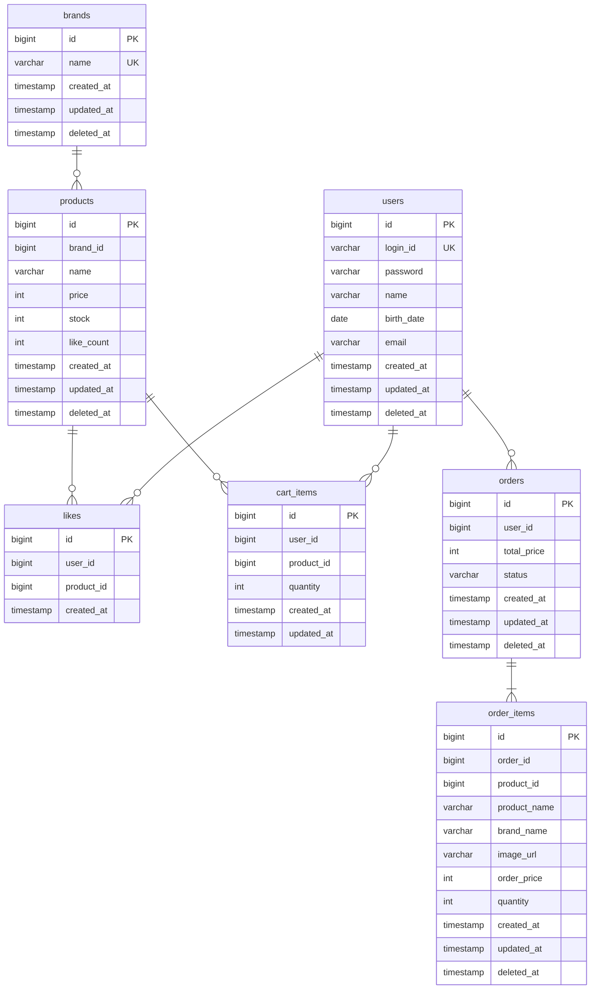

# ERD

> FK 제약조건은 사용하지 않는다. 관계선은 논리적 참조 관계를 나타내며, 실제 DB에서는 ID 컬럼으로만 참조한다.

---

## 다이어그램

---

## 제약조건

| 테이블 | 제약조건 | 설명 |
|---|---|---|
| users | UNIQUE(login_id) | 로그인 ID 중복 방지 |
| brands | UNIQUE(name) | 브랜드명 중복 방지 (409 Conflict) |
| likes | UNIQUE(user_id, product_id) | 1인 1좋아요 보장. 동시성(더블클릭) 방지 |
| cart_items | UNIQUE(user_id, product_id) | 동일 상품 중복 담기 방지 (수량 합산으로 처리) |

---

## 인덱스 권장

| 테이블 | 인덱스 컬럼 | 용도 |
|---|---|---|
| products | brand_id | 브랜드별 상품 필터링, 브랜드 삭제 시 연쇄 soft delete |
| likes | user_id | 유저의 좋아요 목록 조회 |
| cart_items | user_id | 유저의 장바구니 조회 |
| orders | (user_id, created_at) | 유저의 주문 목록 조회 (날짜 범위 필터링) |
| order_items | order_id | 주문의 상세 항목 조회 |

---

## 설계 원칙

- **FK 제약조건 미사용** — ID 컬럼으로 논리적 참조만. 참조 무결성은 애플리케이션 레벨에서 검증한다. FK의 문제(잠금 전파, 데드락 위험, 삭제 순서 강제)를 회피한다.
- **Brand → Product만 객체참조** — JPA에서 `@ManyToOne` + `ConstraintMode.NO_CONSTRAINT`로 객체 참조. DB에 FK 제약조건은 생성하지 않는다. 나머지 관계는 모두 ID 참조.
- **Soft Delete** — brands, products, orders, order_items에 deleted_at 컬럼으로 논리 삭제. 물리적으로 데이터를 제거하지 않는다.
- **Soft Delete 예외** — likes, cart_items는 이력이 필요 없는 토글/임시 데이터이므로 물리 삭제(Hard Delete). UNIQUE 제약조건과의 충돌을 방지한다.
- **공통 컬럼** — BaseEntity 공통 컬럼(id, created_at, updated_at, deleted_at) 포함. likes는 created_at만 사용.
- **Enum 저장** — OrderStatus 등 Enum은 VARCHAR로 저장한다.
- **스냅샷 컬럼** — order_items의 product_name, brand_name, image_url, order_price는 주문 시점의 스냅샷. JPA `@Embedded ProductSnapshot`으로 관리.
- **like_count 비정규화** — products에 like_count 필드로 캐싱. 찜/취소 시 원자적 증감. likes 테이블이 원본 데이터.

---

## 동시성 제어

| 대상 | 방식 | 이유 |
|---|---|---|
| products.stock | 비관적 락 (추후 확정) | 주문 시 재고 차감. 동시 주문에도 재고가 음수가 되어서는 안 된다 |
| products.like_count | 원자적 UPDATE (`SET like_count = like_count + 1`) | 좋아요 등록/취소 시 카운터 증감. 경합이 심하지 않으므로 비관적 락은 과도함 |
| likes | DB UNIQUE 제약 | 더블클릭 시 중복 INSERT 방지. 비관적/분산 락은 과도함 |
| cart_items | DB UNIQUE 제약 | 더블클릭 시 중복 INSERT 방지. 동일 원리 |

---

## 참조 무결성 검증 (애플리케이션 레벨)

FK 제약조건이 없으므로 다음을 애플리케이션에서 검증해야 한다:

- **상품 등록 시** — brand_id가 유효한(삭제되지 않은) 브랜드인지 확인
- **좋아요 토글 시** — product_id가 유효한(삭제되지 않은) 상품인지 확인
- **장바구니 담기 시** — product_id가 유효한(삭제되지 않은) 상품인지 확인 (재고는 확인하지 않음)
- **주문 생성 시** — 모든 product_id가 유효하고, expectedPrice와 현재 가격이 일치하며, 재고가 충분한지 확인

---

## order_items.product_id 포함 이유

order_items는 스냅샷 데이터(product_name, brand_name, image_url, order_price)를 저장하지만, product_id도 함께 보관한다. 스냅샷은 **조회 편의용**이고, product_id는 **데이터 연결용**으로 역할이 다르다.

- 재구매 기능: "이 상품을 다시 구매" 시 원본 상품으로 이동
- 통계 분석: "어떤 상품이 얼마나 팔렸나" 집계 시 product_id 기준으로 GROUP BY
- FK가 아님: 상품이 삭제되어도 주문 내역은 스냅샷으로 보존
