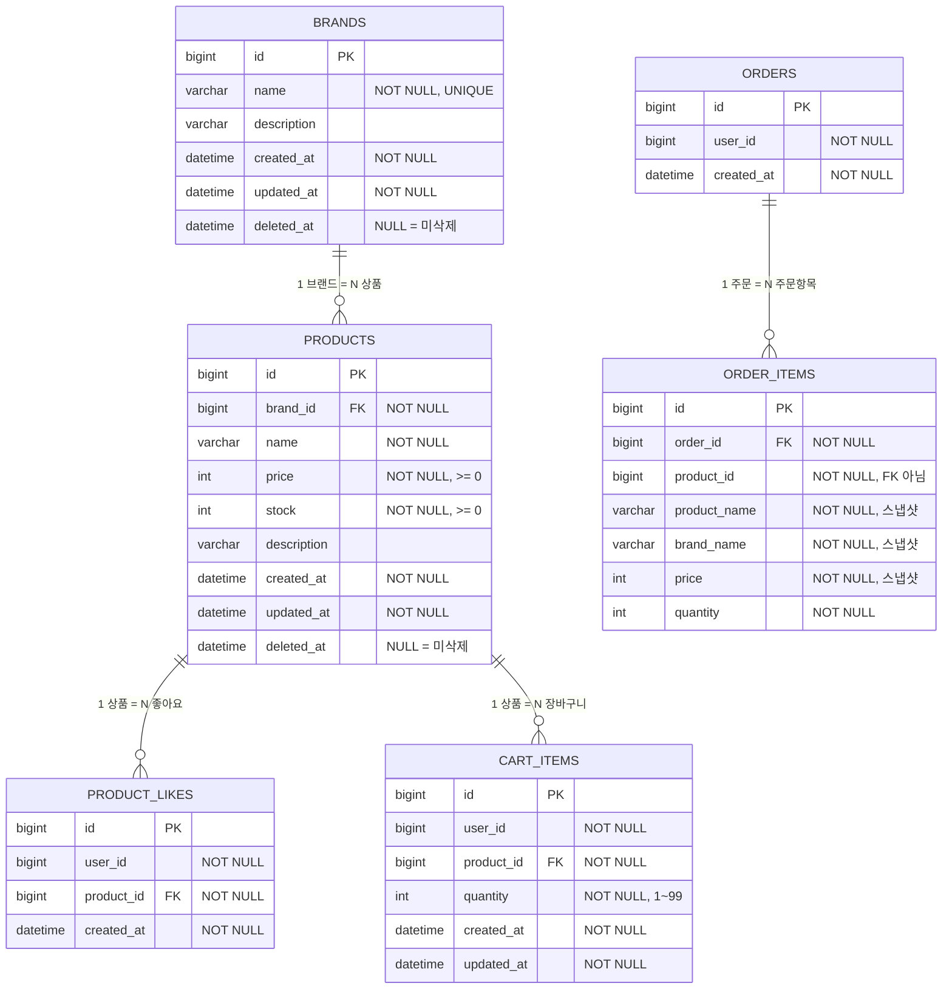

# 04. ERD (Entity-Relationship Diagram)

> 전체 테이블 구조와 관계를 ERD로 표현합니다.
> 영속성 구조, 관계의 주인, 제약 조건을 검증하는 것이 목적입니다.

---

## 다이어그램 선정 기준

ERD는 **전체 데이터 구조를 한 장으로** 표현합니다.
테이블 분리, 컬럼 구성, 관계 방향, 제약 조건이 요구사항과 일치하는지 확인합니다.

---

## 1. 전체 ERD

### 왜 이 다이어그램이 필요한가

6개 테이블의 관계와 컬럼 구성을 한눈에 봅니다.
특히 **OrderItem이 Product를 FK로 참조하지 않는 이유**(스냅샷 설계),
**CartItem에 price가 없는 이유**(현재 가격 사용)를 구조적으로 검증합니다.

### 다이어그램

### 이 다이어그램에서 봐야 할 포인트

- **ORDER_ITEMS.product_id**는 FK가 **아닙니다**. 스냅샷 설계이므로 상품이 삭제되어도 주문 내역이 유지되어야 합니다. FK 제약을 걸면 상품 soft delete 시 참조 무결성 문제가 생깁니다.
- **CART_ITEMS에 price 컬럼이 없습니다**. 장바구니 조회 시 PRODUCTS 테이블의 현재 가격을 JOIN으로 가져옵니다.
- **PRODUCT_LIKES, CART_ITEMS에 deleted_at이 없습니다**. 상품/브랜드 삭제 시 조회 시점에 PRODUCTS.deleted_at을 체크하여 필터링합니다.
- **ORDERS와 CART_ITEMS 사이에 관계가 없습니다**. 장바구니→주문 전환은 클라이언트 레벨에서 처리합니다.

---

## 2. 테이블 상세

### BRANDS

| 컬럼 | 타입 | 제약 | 설명 |
|------|------|------|------|
| id | BIGINT | PK, AUTO_INCREMENT | 브랜드 ID |
| name | VARCHAR(100) | NOT NULL, UNIQUE | 브랜드명 (중복 불가) |
| description | VARCHAR(500) | | 브랜드 설명 |
| created_at | DATETIME | NOT NULL | 등록일 |
| updated_at | DATETIME | NOT NULL | 수정일 |
| deleted_at | DATETIME | NULL | Soft Delete 시각. NULL이면 미삭제 |

### PRODUCTS

| 컬럼 | 타입 | 제약 | 설명 |
|------|------|------|------|
| id | BIGINT | PK, AUTO_INCREMENT | 상품 ID |
| brand_id | BIGINT | FK → BRANDS.id, NOT NULL | 소속 브랜드 |
| name | VARCHAR(200) | NOT NULL | 상품명 |
| price | INT | NOT NULL, >= 0 | 가격 |
| stock | INT | NOT NULL, >= 0 | 재고 수량. 0이면 품절 |
| description | VARCHAR(1000) | | 상품 설명 |
| created_at | DATETIME | NOT NULL | 등록일 |
| updated_at | DATETIME | NOT NULL | 수정일 |
| deleted_at | DATETIME | NULL | Soft Delete 시각 |

### PRODUCT_LIKES

| 컬럼 | 타입 | 제약 | 설명 |
|------|------|------|------|
| id | BIGINT | PK, AUTO_INCREMENT | 좋아요 ID |
| user_id | BIGINT | NOT NULL | 회원 ID |
| product_id | BIGINT | FK → PRODUCTS.id, NOT NULL | 상품 ID |
| created_at | DATETIME | NOT NULL | 좋아요 등록일 |

**유니크 제약**: `UNIQUE(user_id, product_id)` — 회원당 상품당 좋아요 1개

### CART_ITEMS

| 컬럼 | 타입 | 제약 | 설명 |
|------|------|------|------|
| id | BIGINT | PK, AUTO_INCREMENT | 장바구니 항목 ID |
| user_id | BIGINT | NOT NULL | 회원 ID |
| product_id | BIGINT | FK → PRODUCTS.id, NOT NULL | 상품 ID |
| quantity | INT | NOT NULL, 1~99 | 수량 |
| created_at | DATETIME | NOT NULL | 담은 날짜 |
| updated_at | DATETIME | NOT NULL | 수량 변경일 |

**유니크 제약**: `UNIQUE(user_id, product_id)` — 같은 상품 중복 담기 불가 (수량 합산)

### ORDERS

| 컬럼 | 타입 | 제약 | 설명 |
|------|------|------|------|
| id | BIGINT | PK, AUTO_INCREMENT | 주문 ID |
| user_id | BIGINT | NOT NULL | 주문자 ID |
| created_at | DATETIME | NOT NULL | 주문일 |

### ORDER_ITEMS

| 컬럼 | 타입 | 제약 | 설명 |
|------|------|------|------|
| id | BIGINT | PK, AUTO_INCREMENT | 주문 항목 ID |
| order_id | BIGINT | FK → ORDERS.id, NOT NULL | 소속 주문 |
| product_id | BIGINT | NOT NULL | 상품 ID **(FK 아님)** |
| product_name | VARCHAR(200) | NOT NULL | 주문 시점 상품명 (스냅샷) |
| brand_name | VARCHAR(100) | NOT NULL | 주문 시점 브랜드명 (스냅샷) |
| price | INT | NOT NULL | 주문 시점 가격 (스냅샷) |
| quantity | INT | NOT NULL | 주문 수량 |

> **ORDER_ITEMS.product_id가 FK가 아닌 이유**:
> 주문 이후 상품이 삭제되어도 "그때 주문한 상품이 뭐였는지" 참조할 수 있어야 합니다.
> FK 제약이 있으면 상품 삭제(soft delete 포함) 시 참조 무결성 충돌이 발생합니다.

---

## 3. 인덱스 전략

| 테이블 | 인덱스 | 용도 |
|--------|--------|------|
| PRODUCTS | `idx_products_brand_id` (brand_id) | 브랜드별 상품 조회, 브랜드 삭제 시 연쇄 처리 |
| PRODUCTS | `idx_products_deleted_at` (deleted_at) | Soft Delete 필터링 조회 |
| PRODUCT_LIKES | `uq_likes_user_product` (user_id, product_id) | 중복 좋아요 방지 (UNIQUE) |
| PRODUCT_LIKES | `idx_likes_user_id` (user_id) | 내가 좋아요한 목록 조회 |
| PRODUCT_LIKES | `idx_likes_product_id` (product_id) | 상품별 좋아요 수 COUNT |
| CART_ITEMS | `uq_cart_user_product` (user_id, product_id) | 같은 상품 중복 방지 (UNIQUE) |
| CART_ITEMS | `idx_cart_user_id` (user_id) | 내 장바구니 조회 |
| ORDERS | `idx_orders_user_created` (user_id, created_at) | 기간별 주문 목록 조회 |
| ORDER_ITEMS | `idx_order_items_order_id` (order_id) | 주문별 항목 조회 |

---

## 4. 개선 검토 리스트

### 컬럼 관점

| # | 대상 | 현재 | 검토 포인트 |
|---|------|------|-----------|
| 1 | **ORDERS - total_amount** | total_amount 컬럼 없음 | 주문 총액을 매번 ORDER_ITEMS의 `SUM(price * quantity)`로 계산할 것인가? 아니면 ORDERS에 total_amount를 저장할 것인가? 저장하면 조회 성능 향상, 안 하면 정합성 보장 |
| 2 | **ORDER_ITEMS - 추가 스냅샷** | product_name, brand_name, price만 스냅샷 | 상품 이미지 URL, 상품 설명 등 추가 스냅샷 필드가 필요한가? 현재 요구사항에서는 불필요하지만 확장성 관점 |
| 3 | **PRODUCTS - image** | 이미지 관련 컬럼 없음 | 상품 목록/상세에 이미지가 필요하면 image_url 컬럼 추가 필요. 미션 요구사항에 따라 결정 |

### 관계 관점

| # | 대상 | 현재 | 검토 포인트 |
|---|------|------|-----------|
| 4 | **user_id FK 여부** | PRODUCT_LIKES, CART_ITEMS, ORDERS에 user_id는 단순 BIGINT | USERS 테이블에 대한 FK를 걸 것인가? FK를 걸면 참조 무결성이 보장되지만, 모듈 간 결합이 생김 (User는 1주차 도메인) |
| 5 | **CART_ITEMS - product_id FK** | FK → PRODUCTS.id 설정 | 상품이 soft delete되면 FK는 유지되지만, 장바구니 조회 시 deleted_at 체크로 필터링. Hard delete를 하게 되면 FK 제약 문제 발생. 현재 Soft Delete 전략이므로 FK 유지 가능 |

### 정규화 관점

| # | 대상 | 현재 | 검토 포인트 |
|---|------|------|-----------|
| 6 | **ORDER_ITEMS.brand_name** | 브랜드명을 주문 항목마다 중복 저장 | 같은 주문에서 같은 브랜드 상품을 여러 개 주문하면 brand_name이 중복됨. 하지만 스냅샷 특성상 정규화하면 의미가 없음 (브랜드명도 변경될 수 있으므로) |
| 7 | **좋아요 수 비정규화** | likes COUNT 쿼리로 산출 | PRODUCTS에 `like_count` 컬럼을 추가하면 조회 성능 향상. 등록/취소 시 업데이트 필요. 현재는 COUNT 쿼리로 정합성 100% 유지 |

---

## Checklist

- [x] ERD가 전체 테이블 구조를 포함하는가? (6개 테이블)
- [x] 각 테이블의 컬럼, 타입, 제약 조건이 명시되어 있는가?
- [x] FK 관계와 비FK 관계의 구분이 설명되어 있는가? (ORDER_ITEMS.product_id)
- [x] Mermaid 기반으로 작성되었는가?
- [x] 인덱스 전략이 포함되어 있는가?
- [x] "왜 필요한가"와 "봐야 할 포인트"가 포함되어 있는가?
- [x] 개선 검토 리스트가 포함되어 있는가?
