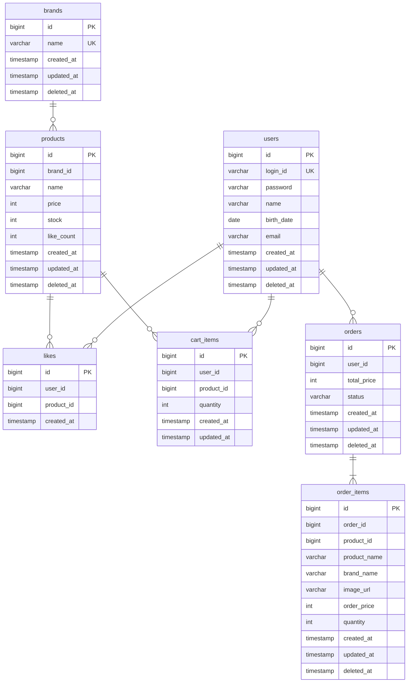
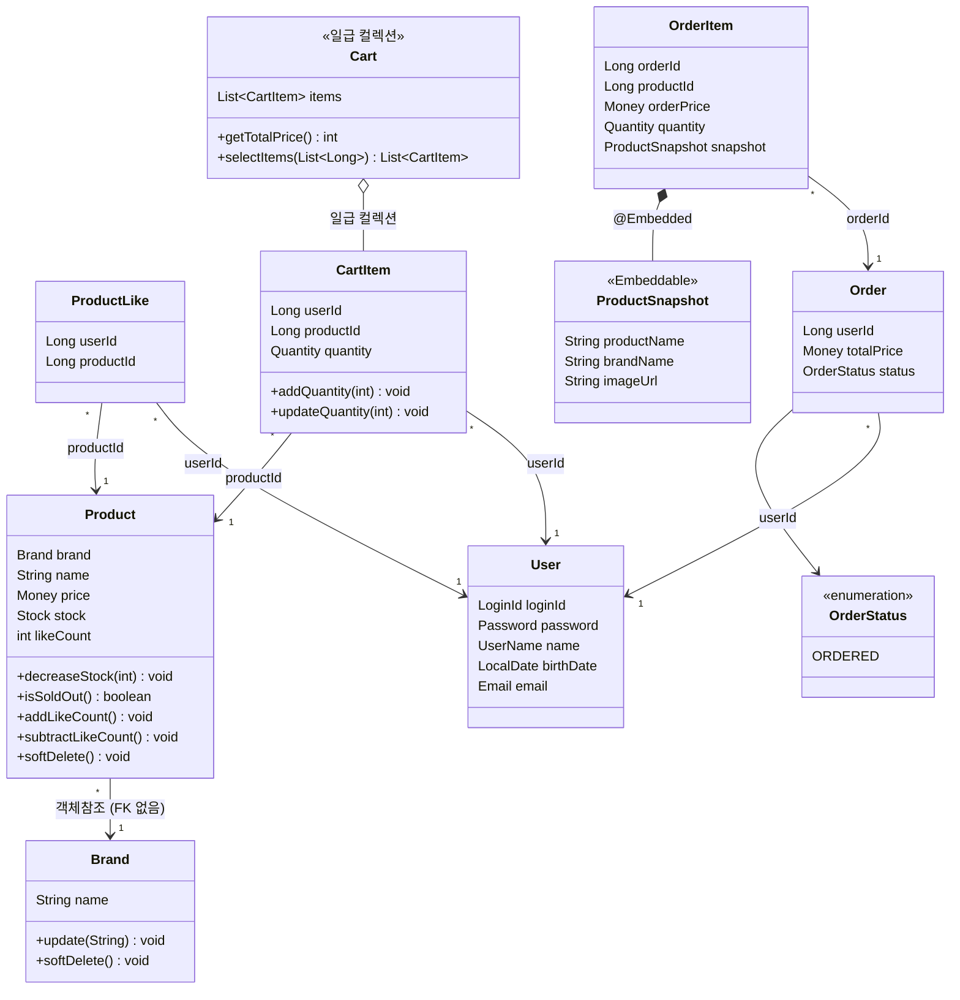

# 전체 설계 조감도

> 전체 구조 파악용. 각 도메인의 상세 스펙은 `{domain}/DESIGN.md` 참조.

---

## 전체 ERD

> FK 제약조건은 사용하지 않는다. 관계선은 논리적 참조 관계를 나타내며, 실제 DB에서는 ID 컬럼으로만 참조한다.

---

## 전체 클래스 다이어그램

---

## 도메인 간 관계 요약

| 관계 | 카디널리티 | 참조 방식 | 비고 |
|---|---|---|---|
| Brand → Product | 1 : N | 객체참조 + FK 없음 | `@ManyToOne` + `ConstraintMode.NO_CONSTRAINT` |
| User → ProductLike | 1 : N | ID 참조 (userId) | UNIQUE(userId, productId) |
| Product → ProductLike | 1 : N | ID 참조 (productId) | 교차 테이블 |
| User → CartItem | 1 : N | ID 참조 (userId) | UNIQUE(userId, productId) |
| Product → CartItem | 1 : N | ID 참조 (productId) | 가격 저장 안 함 |
| User → Order | 1 : N | ID 참조 (userId) | UserSnapshot 불필요 |
| Order → OrderItem | 1 : N | ID 참조 (orderId) | @OneToMany 미사용 |
| OrderItem → ProductSnapshot | 1 : 1 | @Embedded | 주문 시점 스냅샷 |

---

## 제약조건 전체

| 테이블 | 제약조건 | 설명 |
|---|---|---|
| users | UNIQUE(login_id) | 로그인 ID 중복 방지 |
| brands | UNIQUE(name) | 브랜드명 중복 방지 (409 Conflict) |
| likes | UNIQUE(user_id, product_id) | 1인 1좋아요 보장 |
| cart_items | UNIQUE(user_id, product_id) | 동일 상품 중복 담기 방지 |

---

## 인덱스 전체

| 테이블 | 인덱스 컬럼 | 용도 |
|---|---|---|
| products | brand_id | 브랜드별 상품 필터링 |
| likes | user_id | 유저의 좋아요 목록 조회 |
| cart_items | user_id | 유저의 장바구니 조회 |
| orders | (user_id, created_at) | 유저의 주문 목록 조회 |
| order_items | order_id | 주문의 상세 항목 조회 |

---

## 동시성 제어 전체

| 대상 | 방식 | 이유 |
|---|---|---|
| products.stock | 비관적 락 (추후 확정) | 재고 음수 방지 |
| products.like_count | 원자적 UPDATE | 경합 낮음 |
| likes | DB UNIQUE 제약 | 더블클릭 중복 방지 |
| cart_items | DB UNIQUE 제약 | 더블클릭 중복 방지 |
