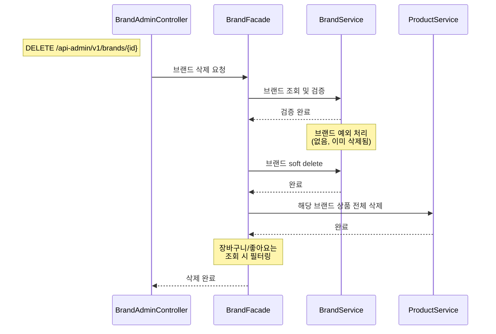
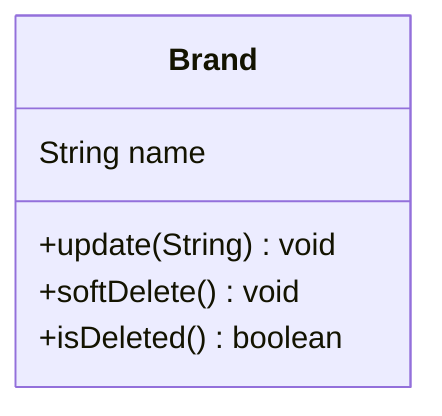
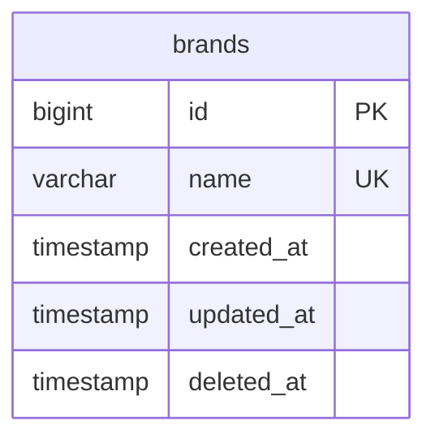

# Brand 도메인 설계

> 공통 설계 원칙은 `_shared/CONVENTIONS.md` 참조

---

## 요구사항

> **비회원으로서**, 브랜드 정보를 조회할 수 있다.
> **관리자로서**, 브랜드를 등록/수정/삭제하여 입점 브랜드를 관리할 수 있다.

### 예외 및 정책

- **Soft Delete** — `deleted_at` 컬럼으로 논리 삭제. 복구 가능성을 열어둔다.
- **브랜드 삭제 연쇄 처리** — 브랜드 soft delete 시 해당 브랜드의 상품도 전체 soft delete. 장바구니/좋아요는 즉시 삭제하지 않고 조회 시점에 필터링.
  ```
  브랜드 soft delete
    └→ 해당 브랜드의 상품 전체 soft delete
        └→ 장바구니 항목: 조회 시 필터링
        └→ 좋아요: 조회 시 필터링
  ```
- **브랜드명 중복 불가** — 동일한 브랜드명이 이미 존재하면 등록/수정 실패 (409 Conflict)
- **고객 vs Admin 응답 차이** — 고객에게는 기본 정보만, Admin에게는 등록일/수정일/삭제 여부 등 관리 정보 추가 제공
- **soft delete된 브랜드** — 고객 조회 불가 (404 반환)
- **Brand → Product 참조** — 객체참조 + FK 없음. `@ManyToOne` + `ConstraintMode.NO_CONSTRAINT`
- **독립 Aggregate Root** — Brand와 Product는 별도 Aggregate Root. 브랜드 삭제 → 상품 soft delete는 Facade에서 조율.

### API

| 기능 | 액터 | Method | URI | 인증 |
|------|------|--------|-----|------|
| 브랜드 정보 조회 | 비회원/회원 | GET | `/api/v1/brands/{brandId}` | X |
| 브랜드 목록 조회 | Admin | GET | `/api-admin/v1/brands?page=0&size=20` | LDAP |
| 브랜드 상세 조회 | Admin | GET | `/api-admin/v1/brands/{brandId}` | LDAP |
| 브랜드 등록 | Admin | POST | `/api-admin/v1/brands` | LDAP |
| 브랜드 정보 수정 | Admin | PUT | `/api-admin/v1/brands/{brandId}` | LDAP |
| 브랜드 삭제 | Admin | DELETE | `/api-admin/v1/brands/{brandId}` | LDAP |

---

## 유즈케이스

**UC-B01: 브랜드 정보 조회 (비회원)**

```
[기능 흐름]
1. 비회원이 brandId로 브랜드 정보를 요청한다
2. 해당 브랜드가 존재하는지 확인한다
3. 브랜드 기본 정보를 반환한다

[예외]
- brandId에 해당하는 브랜드가 없으면 404 반환
- soft delete된 브랜드는 조회 불가 (404 반환)
```

**UC-B02: 브랜드 등록 (Admin)**

```
[기능 흐름]
1. Admin이 브랜드 정보(이름 등)를 입력한다
2. 동일한 브랜드명이 이미 존재하는지 확인한다
3. 브랜드를 저장한다
4. 생성된 브랜드 정보를 반환한다

[예외]
- 이미 존재하는 브랜드명이면 등록 실패 (409 Conflict)

[조건]
- 브랜드명은 필수값이며 중복 불가
```

**UC-B03: 브랜드 정보 수정 (Admin)**

```
[기능 흐름]
1. Admin이 brandId와 수정할 정보를 요청한다
2. 해당 브랜드가 존재하는지 확인한다
3. 브랜드 정보를 업데이트한다

[예외]
- brandId에 해당하는 브랜드가 없거나 삭제된 경우 404 반환
- 수정하려는 브랜드명이 다른 브랜드와 중복되면 409 Conflict
```

**UC-B04: 브랜드 삭제 (Admin)**

```
[기능 흐름]
1. Admin이 brandId로 삭제를 요청한다
2. 해당 브랜드가 존재하는지 확인한다
3. 해당 브랜드를 soft delete 한다
4. 해당 브랜드의 모든 상품도 soft delete 한다

[예외]
- brandId에 해당하는 브랜드가 없으면 404 반환
- 이미 삭제된 브랜드이면 404 반환
```

---

## 시퀀스 다이어그램: 브랜드 삭제 (연쇄 처리)

> 브랜드 삭제는 **Brand 삭제 + Product 연쇄 삭제**를 조율해야 하므로 Facade가 필요하다.



---

## 클래스 설계



### 비즈니스 규칙

| 메서드 | 비즈니스 규칙 |
|---|---|
| update(String) | 브랜드명 변경 |
| softDelete() / isDeleted() | deleted_at 설정. "삭제"의 정의가 바뀌어도 한 곳만 수정 |

---

## ERD



### 제약조건

| 제약조건 | 설명 |
|---|---|
| UNIQUE(name) | 브랜드명 중복 방지 (409 Conflict) |
