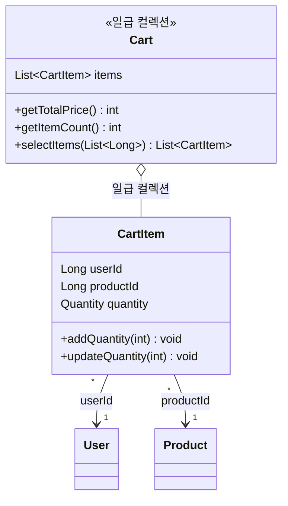
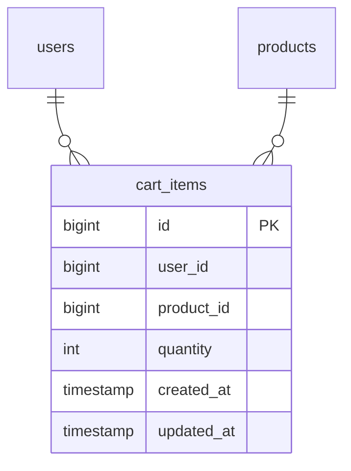

# Cart 도메인 설계

> 공통 설계 원칙은 `_shared/CONVENTIONS.md` 참조

---

## 요구사항

> **회원으로서**, 구매하고 싶은 상품을 장바구니에 담아두고 나중에 한 번에 확인할 수 있다.
> 담은 상품의 수량을 변경하거나 제거할 수 있다.
> 장바구니에 품절 상품이 있으면 품절 상태로, 삭제된 상품은 판매 종료 상태로 보여준다.

### 예외 및 정책

- **Cart 엔티티 미사용** — DB에 Cart 테이블 없음. CartItem만 DB 엔티티. Cart는 코드에서 일급 컬렉션(First-Class Collection)으로 표현하여 "전체 가격 계산", "선택 항목 추출" 등 장바구니 단위 행위를 응집.
- **가격: 현재 가격 기준** — CartItem에 가격을 저장하지 않음 (가격의 원천은 항상 Product). 조회 시 항상 현재 상품 가격 사용. 하이패션 시즌 세일 시 자동 반영.
- **재고: 담기 시 미확인** — 장바구니에 담을 때 재고는 확인하지 않음. 주문 시점에만 확인. 장바구니는 "보관함" 성격.
- **주문과 독립** — Cart 도메인과 Order 도메인은 서로를 모른다. Facade가 경로를 조율.
  ```
  [장바구니 → 주문 흐름]
  장바구니 → CartItem 조회 → OrderItemCommand 변환 → OrderService 호출 → CartItem 삭제

  [바로구매 흐름]
  상품 페이지 → OrderItemCommand 직접 생성 → OrderService 호출
  ```
- **품절 상품** — 자동 제거하지 않음. 품절 표시하고 유저가 직접 제거. 하이패션에서 신중하게 골라 담은 상품이 자동으로 사라지면 UX 저하.
- **삭제된 상품(SoftDelete)** — 판매 종료 표시 + 주문 불가.
- **CartItem 유니크 제약** — userId + productId DB 유니크 제약. 동시성(더블클릭) 시에도 중복 방지.
- **참조 방식** — ID 참조 (userId, productId). 스냅샷 불필요.
- **물리 삭제(Hard Delete)** — 임시 데이터. UNIQUE 제약과 충돌 방지.
- **제약 조건**

  | 제약 | 값 | 근거 |
  |------|-----|------|
  | 상품당 최대 수량 | 99개 | 비정상 요청 방어 |
  | 장바구니 최대 종류 | 100종 | 합리적 상한 + 페이지네이션 적용 |
  | 최소 수량 | 1개 | 수량 0은 불가. 제거는 DELETE API로 명확히 분리 |
  | quantity | 필수값 | 기본값 없음. 클라이언트가 명시적으로 전달 |

### API

| 기능 | 액터 | Method | URI | 인증 |
|------|------|--------|-----|------|
| 장바구니에 상품 담기 | 회원 | POST | `/api/v1/carts` | O |
| 장바구니 목록 조회 | 회원 | GET | `/api/v1/carts?page=0&size=20` | O |
| 장바구니 수량 변경 | 회원 | PUT | `/api/v1/carts/{cartItemId}` | O |
| 장바구니 항목 제거 | 회원 | DELETE | `/api/v1/carts/{cartItemId}` | O |

---

## 유즈케이스

**UC-C01: 장바구니에 상품 담기**

```
[기능 흐름]
1. 회원이 productId와 quantity(필수)로 담기를 요청한다
2. 해당 상품이 존재하는지 확인한다 (삭제된 상품 불가)
3. 장바구니에 같은 상품이 이미 있는지 확인한다
4-a. 없으면: 새 CartItem을 저장한다
4-b. 있으면: 기존 수량에 요청 수량을 합산한다

[예외]
- productId에 해당하는 상품이 없거나 삭제된 경우 실패
- 합산 후 수량이 99를 초과하면 실패
- 장바구니에 이미 100종류가 담겨있으면 신규 상품 담기 실패

[조건]
- quantity는 필수값 (기본값 없음), 1 이상
- 담을 때 재고는 확인하지 않음 (주문 시점에 확인)
- 가격은 저장하지 않음 (조회 시 현재 가격 사용)
- 로그인한 회원만 가능
```

**UC-C02: 장바구니 목록 조회**

```
[기능 흐름]
1. 회원이 장바구니 목록을 요청한다 (page, size)
2. 해당 회원의 장바구니 항목을 조회한다
3. 각 항목의 상품/브랜드 상태를 확인한다
4. 품절(stock=0) 상품은 품절 상태를 표시한다
5. 삭제된(SoftDelete) 상품은 판매 종료 상태를 표시한다
6. 상품의 현재 정보(이름, 가격, 재고 상태)와 함께 반환한다

[조건]
- 가격은 항상 현재 상품 가격 기준
- 페이지네이션 적용 (장바구니 최대 100종류)
- 본인의 장바구니만 조회 가능
- 로그인한 회원만 가능
```

**UC-C03: 장바구니 수량 변경**

```
[기능 흐름]
1. 회원이 cartItemId와 변경할 quantity를 요청한다
2. 해당 장바구니 항목이 존재하는지 확인한다
3. 본인의 장바구니 항목인지 확인한다
4. 수량을 업데이트한다

[예외]
- cartItemId에 해당하는 항목이 없으면 404 반환
- 수량이 1 미만이면 실패 (최소 1)
- 수량이 99 초과이면 실패 (최대 99)

[조건]
- 수량 0으로 변경 불가 → 제거는 DELETE API로만 가능
- 본인의 장바구니 항목만 수정 가능
- 로그인한 회원만 가능
```

**UC-C04: 장바구니 항목 제거**

```
[기능 흐름]
1. 회원이 cartItemId로 제거를 요청한다
2. 해당 장바구니 항목이 존재하는지 확인한다
3. 본인의 장바구니 항목인지 확인한다
4. 해당 항목을 삭제한다

[예외]
- cartItemId에 해당하는 항목이 없으면 404 반환

[조건]
- 본인의 장바구니 항목만 제거 가능
- 로그인한 회원만 가능
```

---

## 클래스 설계



### Value Object

| VO | 검증/행위 | 비즈니스 규칙 |
|---|---|---|
| Quantity | validate() | 1 이상 99 이하 |
| Quantity | add(amount) | 수량 합산, 결과가 99를 초과하면 예외 |

### 비즈니스 규칙

| 엔티티 | 메서드 | 비즈니스 규칙 |
|---|---|---|
| CartItem | addQuantity(int) | 이미 담긴 상품 → 수량 합산. 99 초과 시 예외 |
| CartItem | updateQuantity(int) | 수량 변경. 1~99 범위 검증 |
| Cart | getTotalPrice() | 일급 컬렉션. 장바구니 전체 가격 계산 (Product 현재 가격 기준) |
| Cart | selectItems(List) | 선택한 항목만 추출 (장바구니에서 부분 주문 시) |

---

## ERD



### 제약조건

| 제약조건 | 설명 |
|---|---|
| UNIQUE(user_id, product_id) | 동일 상품 중복 담기 방지 (수량 합산으로 처리) |

### 인덱스

| 인덱스 컬럼 | 용도 |
|---|---|
| cart_items.user_id | 유저의 장바구니 조회 |

### 동시성 제어

| 대상 | 방식 | 이유 |
|---|---|---|
| cart_items | DB UNIQUE 제약 | 더블클릭 시 중복 INSERT 방지 |

### 참조 무결성 검증 (애플리케이션 레벨)

- 장바구니 담기 시 — product_id가 유효한(삭제되지 않은) 상품인지 확인 (재고는 확인하지 않음)
