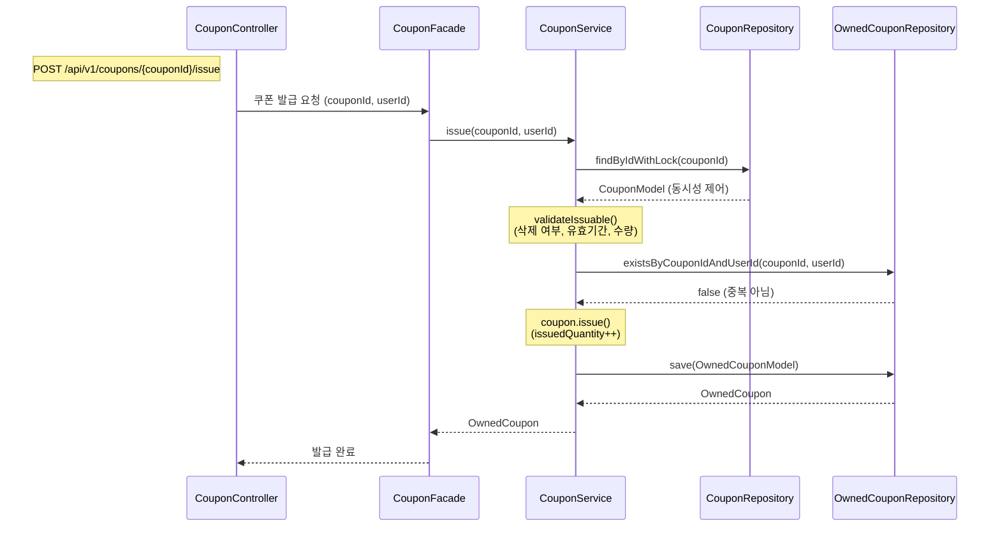
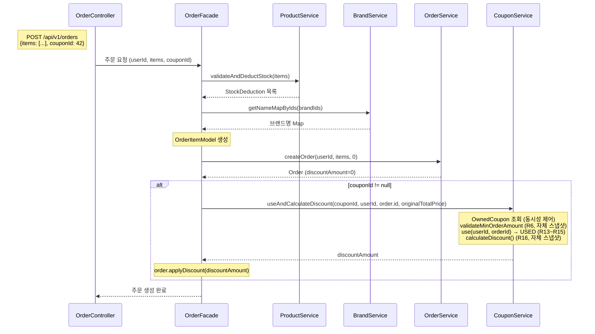
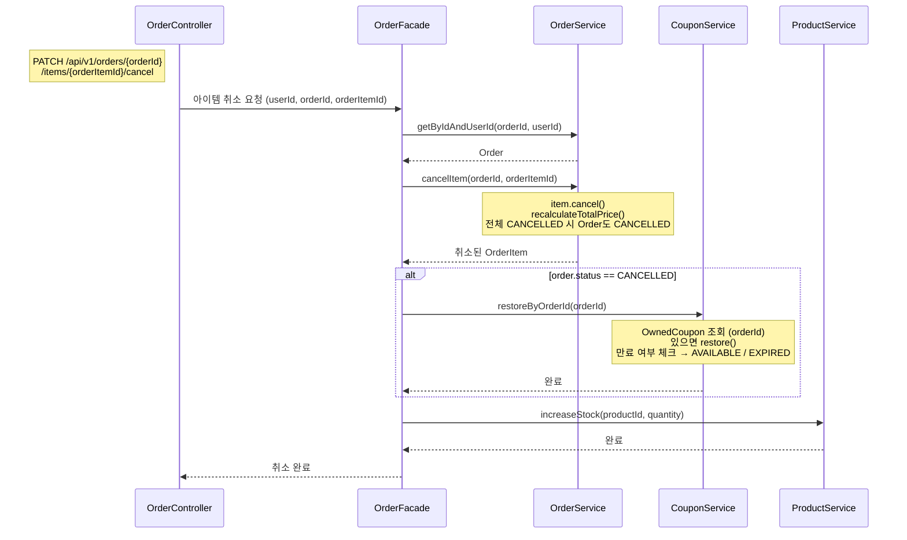
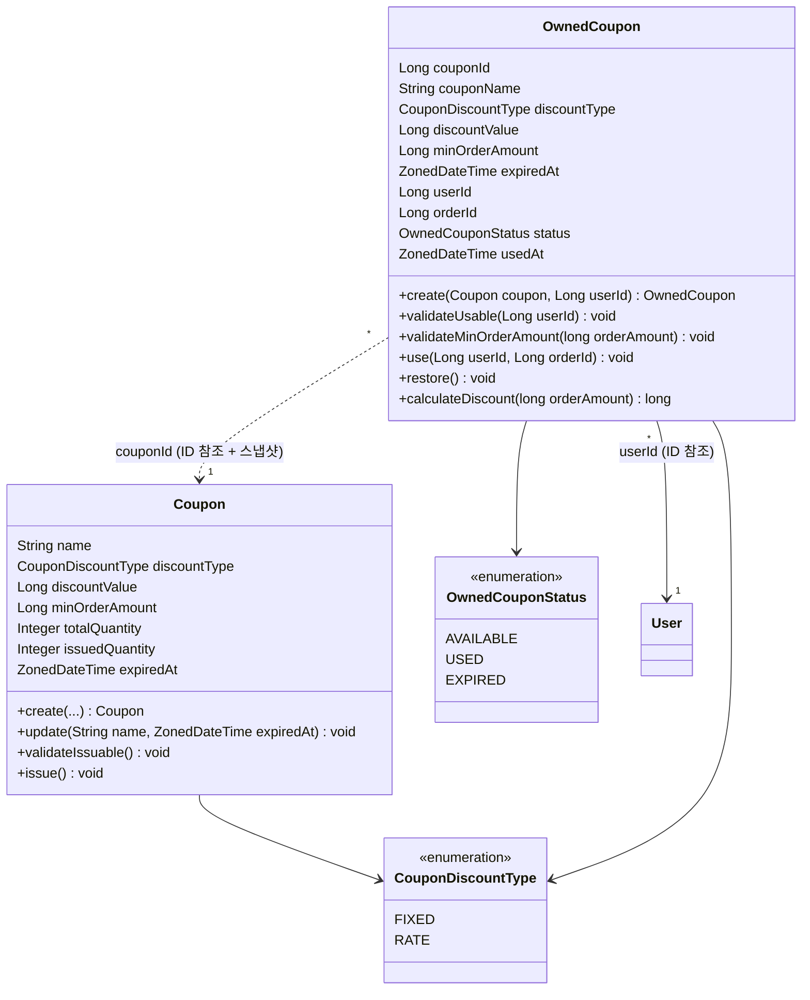
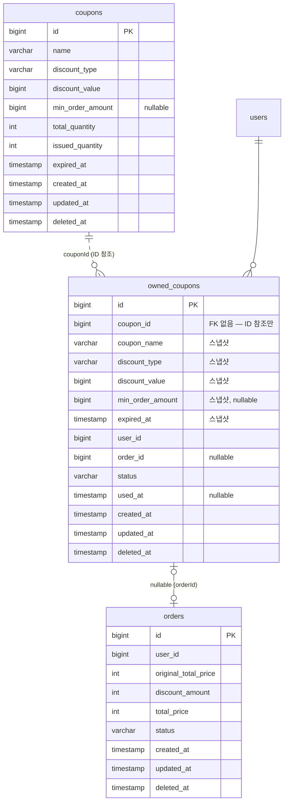

# Coupon 도메인 설계

> 공통 설계 원칙은 `_shared/CONVENTIONS.md` 참조
> 비즈니스 규칙 도출 과정은 `domain-modeling.md` 참조

---

## 요구사항

> **회원으로서**, 쿠폰을 발급받아 주문 시 할인을 적용할 수 있다.
> 보유한 쿠폰 목록을 확인하고, 상태(사용 가능/사용 완료/만료)를 파악할 수 있다.
>
> **관리자로서**, 쿠폰 템플릿을 등록/수정/삭제하여 프로모션을 관리할 수 있다.
> 쿠폰별 발급 내역을 조회할 수 있다.

### 예외 및 정책

- **Soft Delete** — 쿠폰 템플릿은 `deleted_at` 컬럼으로 논리 삭제. 이미 발급된 쿠폰은 삭제 후에도 유효기간까지 정상 사용 가능 (R4).
- **2테이블 구조** — Coupon(템플릿)과 OwnedCoupon(소유 쿠폰). User↔Coupon은 M:N 관계이며 중간 테이블이 자체 상태를 가지므로 독립 엔티티로 분리.
- **2 Aggregate Root** — Coupon과 OwnedCoupon은 생명주기가 다르다(Coupon soft delete 시 OwnedCoupon은 유지). 각각 별도 Aggregate Root.
- **스냅샷 분리** — OwnedCoupon은 발급 시점에 Coupon의 할인 조건(couponName, discountType, discountValue, minOrderAmount, expiredAt)을 스냅샷 복사. Coupon에 대한 `@ManyToOne` 직접 참조 없이 `Long couponId`(ID 참조)만 보유.
- **발급 시점 확정** — 유저가 발급받을 때의 조건이 "계약". Admin이 사후에 Coupon 템플릿을 수정해도 이미 발급된 OwnedCoupon에는 영향 없음.
- **쿠폰 타입** — 정액 할인(FIXED)과 정률 할인(RATE) 두 가지 (R1).
- **수량 제한** — totalQuantity로 총 발급 가능 수량을 제한하고, issuedQuantity로 현재 발급 수량을 추적 (R2).
- **정률 쿠폰 할인 상한 없음** — maxDiscountAmount 필드 없이 PDF 스펙 그대로 (R3).
- **핵심 조건 수정 불가** — type, value, minOrderAmount는 생성 후 수정 불가. name, expiredAt만 수정 가능 (R5).
- **minOrderAmount** — nullable. 설정 시 주문 금액이 미달하면 쿠폰 사용 불가 (R6).
- **유저당 동일 쿠폰 1회 발급** — UNIQUE(coupon_id, user_id) 제약으로 보장 (R7).
- **유효기간 경과 시 발급 불가** (R8).
- **수량 소진 시 발급 불가** (R9).
- **1주문 1쿠폰** — 주문당 쿠폰은 최대 1개 (R11).
- **전체 주문 금액에 적용** — 개별 상품이 아닌 주문 전체 금액 기준 (R12).
- **사용 시점 유효기간 재검증** — AVAILABLE 상태 + 유효기간 미경과만 사용 가능 (R13).
- **본인 소유 쿠폰만 사용 가능** (R14).
- **사용 후 즉시 USED** — 재사용 불가 (R15).
- **할인 금액은 주문 금액 초과 불가** — `Math.min(discount, orderAmount)` 적용. 실 적용 할인액을 기록 (R16).
- **스냅샷 저장** — 주문에 originalTotalPrice(쿠폰 적용 전), discountAmount(할인 금액), totalPrice(최종 결제 금액) 보관 (R17).
- **주문 취소 시 쿠폰 복원** — 전체 취소(모든 아이템 CANCELLED) 시에만 복원. 부분 취소 시 복원하지 않음 (R19).
- **복원 시 만료 여부 체크** — 유효기간 경과 시 EXPIRED, 미경과 시 AVAILABLE로 복원 (R20).
- **만료 처리** — 배치 스케줄러로 AVAILABLE → EXPIRED 전이 + 사용/조회 시점 동적 검증 병행 (R21~R23).
- **내 쿠폰 목록** — AVAILABLE / USED / EXPIRED 상태 모두 반환 (R24).

### API

| 기능 | 액터 | Method | URI | 인증 |
|------|------|--------|-----|------|
| 쿠폰 발급 | 회원 | POST | `/api/v1/coupons/{couponId}/issue` | O |
| 내 쿠폰 목록 조회 | 회원 | GET | `/api/v1/users/me/coupons` | O |
| 쿠폰 목록 조회 | Admin | GET | `/api-admin/v1/coupons?page=0&size=20` | LDAP |
| 쿠폰 상세 조회 | Admin | GET | `/api-admin/v1/coupons/{couponId}` | LDAP |
| 쿠폰 등록 | Admin | POST | `/api-admin/v1/coupons` | LDAP |
| 쿠폰 수정 | Admin | PUT | `/api-admin/v1/coupons/{couponId}` | LDAP |
| 쿠폰 삭제 | Admin | DELETE | `/api-admin/v1/coupons/{couponId}` | LDAP |
| 쿠폰 발급 내역 조회 | Admin | GET | `/api-admin/v1/coupons/{couponId}/issues?page=0&size=20` | LDAP |

### 주문 API 변경

기존 주문 요청 본문에 `couponId` 필드 추가 (nullable).

```json
{
  "items": [
    { "productId": 1, "quantity": 2, "expectedPrice": 50000 },
    { "productId": 3, "quantity": 1, "expectedPrice": 120000 }
  ],
  "couponId": 42
}
```

> `couponId`는 OwnedCoupon의 ID를 의미한다. 사용 불가능한 쿠폰으로 요청 시 주문은 실패해야 한다.

---

## 유즈케이스

**UC-C01: 쿠폰 등록 (Admin)**

```
[기능 흐름]
1. Admin이 쿠폰 정보(name, type, value, minOrderAmount, totalQuantity, expiredAt)를 입력한다
2. 입력값을 검증한다
3. 쿠폰 템플릿을 저장한다
4. 생성된 쿠폰 정보를 반환한다

[예외]
- name이 비어있으면 등록 실패
- discountValue가 0 이하이면 등록 실패
- RATE 타입일 때 discountValue가 1~100 범위가 아니면 등록 실패
- totalQuantity가 1 미만이면 등록 실패
- expiredAt이 현재 시각 이전이면 등록 실패

[조건]
- LDAP 인증 필요
- issuedQuantity는 0으로 초기화
```

**UC-C02: 쿠폰 수정 (Admin)**

```
[기능 흐름]
1. Admin이 couponId와 수정할 정보(name, expiredAt)를 요청한다
2. 해당 쿠폰이 존재하는지 확인한다
3. 수정 가능한 필드만 업데이트한다

[예외]
- couponId에 해당하는 쿠폰이 없거나 삭제된 경우 404 반환
- type, value, minOrderAmount 수정 시도 시 실패 (핵심 조건 수정 불가, R5)

[조건]
- name, expiredAt만 수정 가능
```

**UC-C03: 쿠폰 삭제 (Admin)**

```
[기능 흐름]
1. Admin이 couponId로 삭제를 요청한다
2. 해당 쿠폰이 존재하는지 확인한다
3. 해당 쿠폰을 soft delete 한다

[예외]
- couponId에 해당하는 쿠폰이 없으면 404 반환
- 이미 삭제된 쿠폰이면 404 반환

[조건]
- 이미 발급된 OwnedCoupon은 영향받지 않음 (유효기간까지 정상 사용)
```

**UC-C04: 쿠폰 목록 조회 (Admin)**

```
[기능 흐름]
1. Admin이 쿠폰 목록을 요청한다 (page, size)
2. soft delete되지 않은 쿠폰 목록을 페이지네이션하여 반환한다

[조건]
- LDAP 인증 필요
```

**UC-C05: 쿠폰 상세 조회 (Admin)**

```
[기능 흐름]
1. Admin이 couponId로 쿠폰 상세를 요청한다
2. 해당 쿠폰이 존재하는지 확인한다
3. 쿠폰 상세 정보(발급 수량 포함)를 반환한다

[예외]
- couponId에 해당하는 쿠폰이 없거나 삭제된 경우 404 반환
```

**UC-C06: 쿠폰 발급 내역 조회 (Admin)**

```
[기능 흐름]
1. Admin이 couponId로 발급 내역을 요청한다 (page, size)
2. 해당 쿠폰이 존재하는지 확인한다
3. 해당 쿠폰의 OwnedCoupon 목록을 페이지네이션하여 반환한다

[예외]
- couponId에 해당하는 쿠폰이 없거나 삭제된 경우 404 반환

[조건]
- LDAP 인증 필요
```

**UC-C07: 쿠폰 발급 (회원)**

```
[기능 흐름]
1. 회원이 couponId로 쿠폰 발급을 요청한다
2. 쿠폰 템플릿을 조회한다 (동시성 제어)
3. 발급 가능 여부를 검증한다 (삭제 여부, 유효기간, 수량)
4. 유저당 중복 발급 여부를 확인한다
5. issuedQuantity를 증가시킨다
6. OwnedCoupon을 생성하여 저장한다

[예외]
- 쿠폰이 존재하지 않거나 삭제된 경우 실패
- 유효기간이 경과한 경우 실패 (R8)
- 수량이 소진된 경우 실패 (R9)
- 이미 발급받은 쿠폰인 경우 실패 (R7)

[조건]
- 로그인한 회원만 가능
- 동시 발급 시 issuedQuantity 정합성 보장 필요 (R10)
- UNIQUE(coupon_id, user_id) 제약으로 이중 안전장치
```

**UC-C08: 내 쿠폰 목록 조회 (회원)**

```
[기능 흐름]
1. 회원이 내 쿠폰 목록을 요청한다
2. 해당 유저의 OwnedCoupon 목록을 조회한다
3. 모든 상태(AVAILABLE, USED, EXPIRED)의 쿠폰을 반환한다

[조건]
- 로그인한 회원만 가능
- 본인의 쿠폰만 조회 가능
```

**UC-C09: 쿠폰 적용 주문 생성**

```
[기능 흐름]
1. 회원이 상품 목록과 couponId(nullable)로 주문을 요청한다
2. 상품 검증 + 재고 차감 (기존 주문 흐름)
3. 주문 생성 (discountAmount = 0)
4. couponId가 있으면:
   a. OwnedCoupon을 조회한다 (동시성 제어)
   b. 최소 주문 금액 검증 — OwnedCoupon 자체 스냅샷 사용 (R6)
   c. 본인 소유 + AVAILABLE 상태 + 유효기간 미경과 검증 — 자체 스냅샷 (R13, R14)
   d. OwnedCoupon을 USED로 전이, orderId 기록 (R15)
   e. 할인 금액 계산 — OwnedCoupon 자체 스냅샷 사용 (R16)
   f. order.applyDiscount(discountAmount) — 주문에 할인 반영

[예외]
- 쿠폰이 존재하지 않으면 주문 실패 (트랜잭션 롤백)
- 본인 소유가 아니면 주문 실패 (트랜잭션 롤백)
- AVAILABLE이 아니면 주문 실패 (트랜잭션 롤백)
- 유효기간 경과 시 주문 실패 (트랜잭션 롤백)
- 최소 주문 금액 미달 시 주문 실패 (트랜잭션 롤백)

[조건]
- couponId가 null이면 기존 주문 흐름과 동일 (쿠폰 미적용)
- 동시에 같은 쿠폰을 사용하는 요청 시 정합성 보장 필요 (R18)
- Order 먼저 생성 후 쿠폰 사용 — orderId를 OwnedCoupon에 전달하기 위함
- 쿠폰 검증 실패 시 트랜잭션 롤백으로 Order도 함께 취소
```

**UC-C10: 주문 취소 시 쿠폰 복원**

```
[기능 흐름]
1. 기존 주문 아이템 취소 흐름 수행
2. 모든 아이템이 CANCELLED → 주문 자체가 CANCELLED 전이
3. 주문이 CANCELLED이면:
   a. orderId로 OwnedCoupon 조회 (없으면 no-op)
   b. OwnedCoupon.restore() 호출
   c. 유효기간 체크 → AVAILABLE 또는 EXPIRED로 복원

[조건]
- 부분 취소 시 쿠폰 복원하지 않음 (할인은 주문 전체에 적용, R12)
- 전체 취소 시에만 복원 (R19)
```

---

## 시퀀스 다이어그램

### 쿠폰 발급



### 쿠폰 적용 주문 생성

> 주문은 **Product 도메인 (재고) + Coupon 도메인 (할인) + Order 도메인 (주문)**을 조율해야 하므로 Facade가 필요하다.
> Order를 먼저 생성(discountAmount=0)한 뒤, 쿠폰을 사용하여 orderId를 연결하고, Order에 할인을 반영한다.



### 주문 취소 시 쿠폰 복원



---

## 클래스 설계



### 비즈니스 규칙

| 엔티티 | 메서드 | 비즈니스 규칙 |
|---|---|---|
| Coupon | create(...) | 정적 팩토리. name, discountType, discountValue, minOrderAmount, totalQuantity, expiredAt 검증 후 생성. issuedQuantity = 0 |
| Coupon | update(name, expiredAt) | 수정 가능 필드만 변경 (R5). 핵심 조건(type, value, minOrderAmount)은 수정 불가 |
| Coupon | validateIssuable() | 삭제 여부, 유효기간 경과, 수량 소진 검증 (R4, R8, R9) |
| Coupon | issue() | validateIssuable() 후 issuedQuantity++ (R10 동시성 제어 대상) |
| OwnedCoupon | create(coupon, userId) | 정적 팩토리. status = AVAILABLE. Coupon의 할인 조건을 스냅샷으로 복사 |
| OwnedCoupon | validateUsable(userId) | 본인 소유 확인 (R14), AVAILABLE 상태 확인 (R13), 유효기간 재검증 (자체 스냅샷) |
| OwnedCoupon | validateMinOrderAmount(orderAmount) | minOrderAmount가 있고 주문 금액 미달 시 예외 (R6). 자체 스냅샷 사용 |
| OwnedCoupon | use(userId, orderId) | validateUsable() 후 status → USED, usedAt 기록, orderId 기록 (R15) |
| OwnedCoupon | restore() | USED 상태만 복원 가능. 유효기간 체크 후 AVAILABLE 또는 EXPIRED로 복원. orderId = null (R19, R20) |
| OwnedCoupon | calculateDiscount(orderAmount) | FIXED: discountValue, RATE: orderAmount * discountValue / 100. `Math.min(discount, orderAmount)` (R16). 자체 스냅샷 사용 |

### 관계 정리

| 관계 | 참조 방식 | 설명 |
|---|---|---|
| OwnedCoupon → Coupon | `Long couponId` (ID 참조) + 스냅샷 필드 | 별도 Aggregate Root 간 ID 참조. 발급 시점에 할인 조건(couponName, discountType, discountValue, minOrderAmount, expiredAt)을 스냅샷 복사 |
| OwnedCoupon → User | ID 참조 (`Long userId`) | 도메인 간 경계. 객체 참조 없음 |
| OwnedCoupon → Order | ID 참조 (`Long orderId`, nullable) | 도메인 간 경계. 쿠폰 사용 시 어떤 주문에서 사용되었는지 기록 |
| Order → OwnedCoupon | 참조 없음 | Order는 할인 결과(discountAmount)만 보유. 할인 출처를 모름 |
| User → OwnedCoupon | 역참조 없음 | CouponService.getMyOwnedCoupons(userId)로 접근 |

---

## ERD



### 인덱스

| 인덱스 컬럼 | 용도 |
|---|---|
| owned_coupons (coupon_id, user_id) UNIQUE | 유저당 동일 쿠폰 중복 발급 방지 (R7) |
| owned_coupons (user_id) | 내 쿠폰 목록 조회 |
| owned_coupons (coupon_id) | Admin 발급 내역 조회 |

### 동시성 제어

| 대상 | 시나리오 | 방식 |
|---|---|---|
| coupons.issued_quantity | 동시 발급 시 수량 초과 방지 | **TBD** — 향후 비관적 락/낙관적 락/분산 락 비교 테스트 후 결정 |
| owned_coupons.status | 같은 쿠폰 동시 사용 방지 | **TBD** — 향후 비관적 락/낙관적 락/분산 락 비교 테스트 후 결정 |

> 동시성 제어 전략은 각 방식을 직접 구현하고 동시성 테스트로 비교한 뒤 결정한다.

### 참조 무결성 검증 (애플리케이션 레벨)

- 쿠폰 발급 시 — couponId가 유효하고, 삭제되지 않았으며, 유효기간 내이고, 수량이 남아있는지 확인
- 쿠폰 사용 시 — ownedCouponId가 유효하고, 본인 소유이며, AVAILABLE 상태이고, 유효기간 내인지 확인
- 주문 취소 시 — orderId로 OwnedCoupon을 찾아 복원 (없으면 no-op)

### Order 도메인 변경사항

주문에 할인 결과 필드만 추가 (할인 출처는 Order가 모름):

| 필드 | 타입 | 설명 |
|---|---|---|
| discountAmount | int (default 0) | 실 할인 적용 금액 |
| originalTotalPrice | int | 기존 필드 유지. 할인 적용 전 상품 합계 금액 |
| totalPrice | int | 기존 필드. `originalTotalPrice - discountAmount`로 계산 |

> `ownedCouponId`는 Order에 두지 않는다. 할인 출처 추적은 OwnedCoupon.orderId가 담당한다.

기존 `OrderModel.create(userId, items)` 시그니처는 유지하되, 할인 포함 오버로드 추가:
`OrderModel.create(userId, items, discountAmount)`

### OwnedCoupon 도메인 변경사항

쿠폰 사용 시 주문 참조 필드 추가:

| 필드 | 타입 | 설명 |
|---|---|---|
| orderId | Long (nullable) | 이 쿠폰이 사용된 주문 ID. 사용 전/복원 후에는 null |
