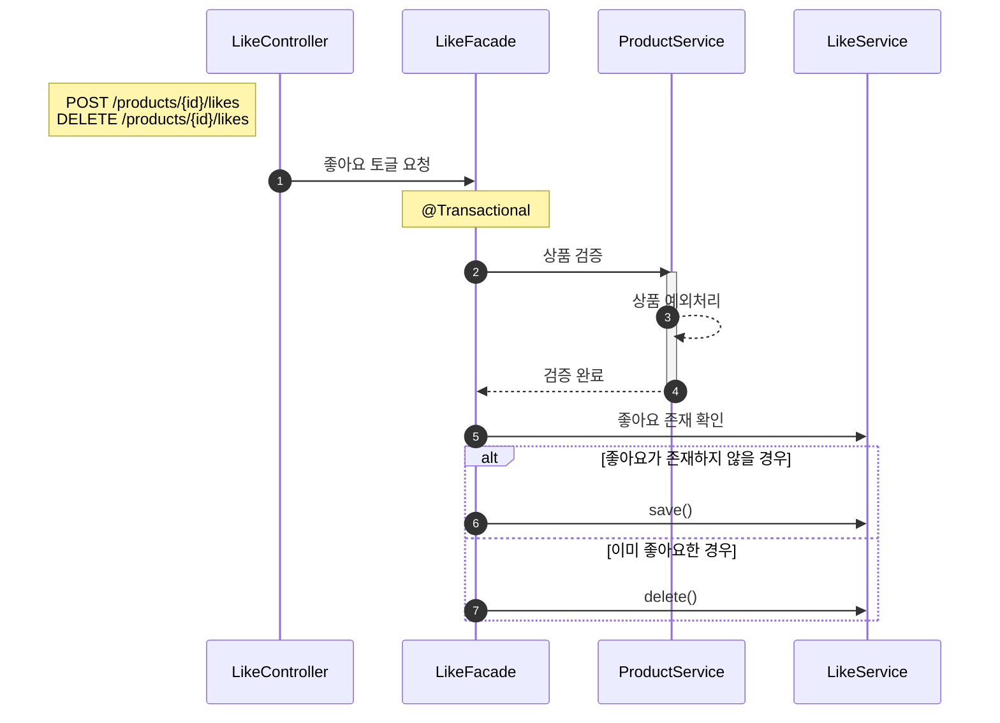
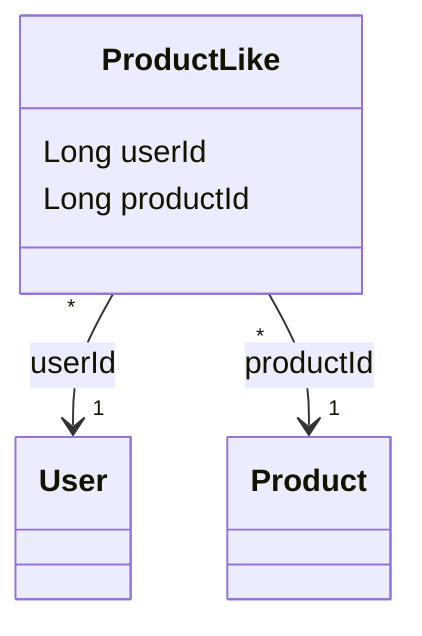
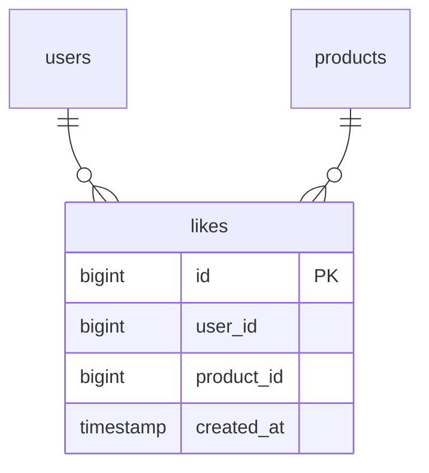

# Like 도메인 설계

> 공통 설계 원칙은 `_shared/CONVENTIONS.md` 참조

---

## 요구사항

> **회원으로서**, 마음에 드는 상품에 좋아요를 눌러 선호를 표현하고, 나중에 다시 찾아볼 수 있다.
> 이미 좋아요한 상품은 취소할 수 있다.

### 예외 및 정책

- **좋아요 수: Product.likeCount 캐시** — Like 엔티티가 원본 데이터, Product.likeCount는 조회 성능을 위한 파생값(derived data). 찜/취소 시 원자적 증감.
- **API 방식: 엔드포인트 분리 + 내부 토글** — POST/DELETE 엔드포인트는 분리하되, 내부적으로 같은 Facade 메서드(toggleLike)를 호출. 409/404 없음.
- **회원당 상품당 1개** — userId + productId DB 유니크 제약. 동시성(더블클릭) 시에도 중복 방지.
- **삭제된 상품/브랜드의 좋아요** — 목록 조회 시 필터링으로 제외.
- **상품 검증 항상 수행** — 등록/취소 모두 ProductService로 상품 존재 + 삭제 여부 확인.
- **참조 방식** — 모두 ID 참조 (userId, productId).
- **물리 삭제(Hard Delete)** — 이력 불필요. UNIQUE 제약과 충돌 방지.

### API

| 기능 | 액터 | Method | URI | 인증 |
|------|------|--------|-----|------|
| 상품 좋아요 등록 | 회원 | POST | `/api/v1/products/{productId}/likes` | O |
| 상품 좋아요 취소 | 회원 | DELETE | `/api/v1/products/{productId}/likes` | O |
| 내가 좋아요한 상품 목록 조회 | 회원 | GET | `/api/v1/users/{userId}/likes` | O |

---

## 유즈케이스

**UC-L01: 상품 좋아요 토글 (등록/취소)**

```
[기능 흐름]
1. 회원이 productId로 좋아요를 요청한다 (POST 또는 DELETE)
2. 해당 상품이 존재하는지 확인한다 (삭제된 상품 불가)
3. 좋아요 존재 여부를 확인한다
4-a. 좋아요가 없으면: 좋아요를 저장한다 (등록)
4-b. 좋아요가 있으면: 좋아요를 삭제한다 (취소)

[예외]
- productId에 해당하는 상품이 없거나 삭제된 경우 404 반환

[조건]
- 로그인한 회원만 가능
- 회원당 상품당 1개만 저장 (유니크 제약)
- POST/DELETE 모두 같은 Facade 메서드(toggleLike)를 호출
- 이미 좋아요한 상품에 POST → 좋아요 취소 (409 없음)
- 좋아요하지 않은 상품에 DELETE → 좋아요 등록 (404 없음)
```

**UC-L02: 내가 좋아요한 상품 목록 조회**

```
[기능 흐름]
1. 회원이 자신의 좋아요 목록을 요청한다
2. likes 테이블에서 해당 회원의 좋아요 목록을 조회한다
3. 상품/브랜드가 삭제되지 않은 항목만 필터링한다
4. 상품 정보와 함께 반환한다

[조건]
- 로그인한 회원만 가능
- soft delete된 상품/브랜드는 목록에서 제외 (조회 시 필터링)
- 본인의 좋아요 목록만 조회 가능 (타 유저 접근 불가)
```

---

## 시퀀스 다이어그램: 좋아요 등록/취소

> 좋아요는 **Product 검증 + Like 등록/취소**를 조율해야 하므로 Facade가 필요하다.



---

## 클래스 설계



> ProductLike는 created_at만 사용 (BaseEntity의 updated_at, deleted_at 불필요).

---

## ERD



### 제약조건

| 제약조건 | 설명 |
|---|---|
| UNIQUE(user_id, product_id) | 1인 1좋아요 보장. 동시성(더블클릭) 방지 |

### 인덱스

| 인덱스 컬럼 | 용도 |
|---|---|
| likes.user_id | 유저의 좋아요 목록 조회 |

### 동시성 제어

| 대상 | 방식 | 이유 |
|---|---|---|
| likes | DB UNIQUE 제약 | 더블클릭 시 중복 INSERT 방지. 비관적/분산 락은 과도함 |
| products.like_count | 원자적 UPDATE (`SET like_count = like_count + 1`) | 경합이 심하지 않으므로 비관적 락은 과도함 |

### 참조 무결성 검증 (애플리케이션 레벨)

- 좋아요 토글 시 — product_id가 유효한(삭제되지 않은) 상품인지 확인
