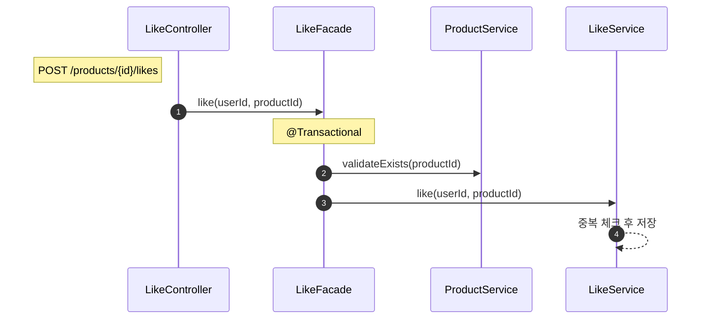
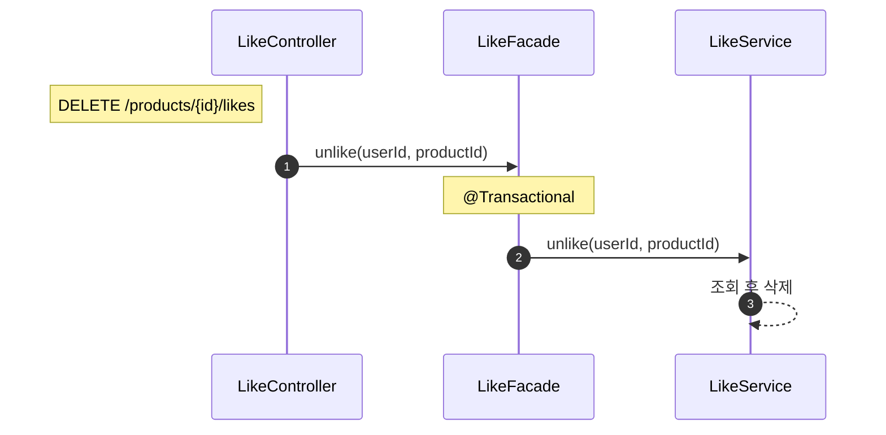
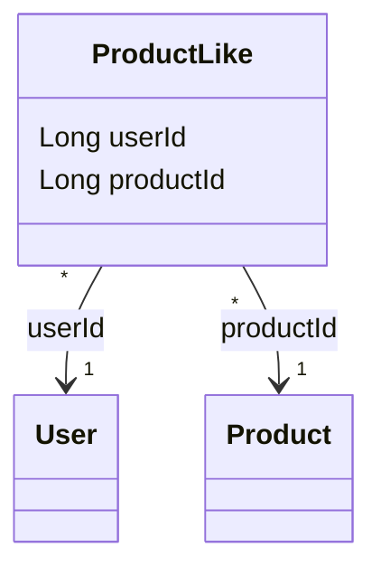
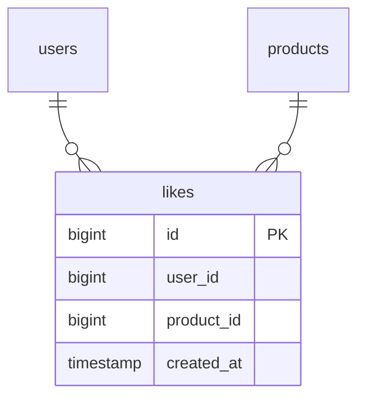

# Like 도메인 설계

> 공통 설계 원칙은 `_shared/CONVENTIONS.md` 참조

---

## 요구사항

> **회원으로서**, 마음에 드는 상품에 좋아요를 눌러 선호를 표현하고, 나중에 다시 찾아볼 수 있다.
> 이미 좋아요한 상품은 취소할 수 있다.

### 예외 및 정책

- **좋아요 수: COUNT(*) 실시간 쿼리** — likes 테이블에서 COUNT(*)로 조회. Product 엔티티에 캐시 필드를 두지 않는다.
- **API 방식: 엔드포인트 분리** — POST/DELETE 엔드포인트를 분리하고, Facade도 like/unlike 메서드를 각각 제공.
- **중복 방어: 이중 방어** — 애플리케이션 레벨 중복 체크(1차) + DB UNIQUE 제약(2차). 중복 시 CONFLICT 예외.
- **회원당 상품당 1개** — userId + productId DB 유니크 제약. 동시성(더블클릭) 시에도 중복 방지.
- **삭제된 상품/브랜드의 좋아요** — 목록 조회 시 필터링으로 제외.
- **상품 검증** — 등록 시에만 ProductService로 상품 존재 확인. 취소 시에는 Like 도메인 내에서 처리.
- **참조 방식** — 모두 ID 참조 (userId, productId).
- **물리 삭제(Hard Delete)** — 이력 불필요. UNIQUE 제약과 충돌 방지.

### API

| 기능 | 액터 | Method | URI | 인증 |
|------|------|--------|-----|------|
| 상품 좋아요 등록 | 회원 | POST | `/api/v1/products/{productId}/likes` | O |
| 상품 좋아요 취소 | 회원 | DELETE | `/api/v1/products/{productId}/likes` | O |
| 내가 좋아요한 상품 목록 조회 | 회원 | GET | `/api/v1/users/{userId}/likes` | O |

---

## 유즈케이스

**UC-L01: 상품 좋아요 등록/취소**

```
[기능 흐름 - 등록 (POST)]
1. 회원이 productId로 좋아요 등록을 요청한다
2. 해당 상품이 존재하는지 확인한다 (삭제된 상품 불가)
3. 중복 좋아요인지 확인한다
4. 좋아요를 저장한다

[기능 흐름 - 취소 (DELETE)]
1. 회원이 productId로 좋아요 취소를 요청한다
2. 좋아요 기록을 조회한다
3. 좋아요를 삭제한다

[예외]
- 등록 시: 상품이 없거나 삭제된 경우 404, 이미 좋아요한 경우 409
- 취소 시: 좋아요 기록이 없는 경우 404

[조건]
- 로그인한 회원만 가능
- 회원당 상품당 1개만 저장 (애플리케이션 체크 + DB 유니크 제약)
```

**UC-L02: 내가 좋아요한 상품 목록 조회**

```
[기능 흐름]
1. 회원이 자신의 좋아요 목록을 요청한다
2. likes 테이블에서 해당 회원의 좋아요 목록을 조회한다
3. 상품/브랜드가 삭제되지 않은 항목만 필터링한다
4. 상품 정보와 함께 반환한다

[조건]
- 로그인한 회원만 가능
- soft delete된 상품/브랜드는 목록에서 제외 (조회 시 필터링)
- 본인의 좋아요 목록만 조회 가능 (타 유저 접근 불가)
```

---

## 시퀀스 다이어그램: 좋아요 등록/취소

> 좋아요 등록은 **Product 존재 확인 + Like 등록**을 조율해야 하므로 Facade가 필요하다.


```mermaid
sequenceDiagram
    autonumber

    participant LC as LikeController
    participant LF as LikeFacade
    participant PS as ProductService
    participant LS as LikeService

    Note left of LC: POST /products/{id}/likes

    LC->>LF: like(userId, productId)

    Note over LF: @Transactional
    LF->>PS: validateExists(productId)
    LF->>LS: like(userId, productId)
    LS-->>LS: 중복 체크 후 저장
```


```mermaid
sequenceDiagram
    autonumber

    participant LC as LikeController
    participant LF as LikeFacade
    participant LS as LikeService

    Note left of LC: DELETE /products/{id}/likes

    LC->>LF: unlike(userId, productId)

    Note over LF: @Transactional
    LF->>LS: unlike(userId, productId)
    LS-->>LS: 조회 후 삭제
```

---

## 클래스 설계


```mermaid
classDiagram
    class ProductLike {
        Long userId
        Long productId
    }

    ProductLike "*" --> "1" User : userId
    ProductLike "*" --> "1" Product : productId
```

> ProductLike는 created_at만 사용 (BaseEntity의 updated_at, deleted_at 불필요).

---

## ERD


```mermaid
erDiagram
    likes {
        bigint id PK
        bigint user_id
        bigint product_id
        timestamp created_at
    }

    users ||--o{ likes : ""
    products ||--o{ likes : ""
```

### 제약조건

| 제약조건 | 설명 |
|---|---|
| UNIQUE(user_id, product_id) | 1인 1좋아요 보장. 동시성(더블클릭) 방지 |

### 인덱스

| 인덱스 컬럼 | 용도 |
|---|---|
| likes.user_id | 유저의 좋아요 목록 조회 |

### 동시성 제어

| 대상 | 방식 | 이유 |
|---|---|---|
| likes | 애플리케이션 중복 체크(1차) + DB UNIQUE 제약(2차) | 이중 방어. 더블클릭 시에도 중복 INSERT 방지 |

### 참조 무결성 검증 (애플리케이션 레벨)

- 좋아요 등록 시 — product_id가 유효한(삭제되지 않은) 상품인지 확인
