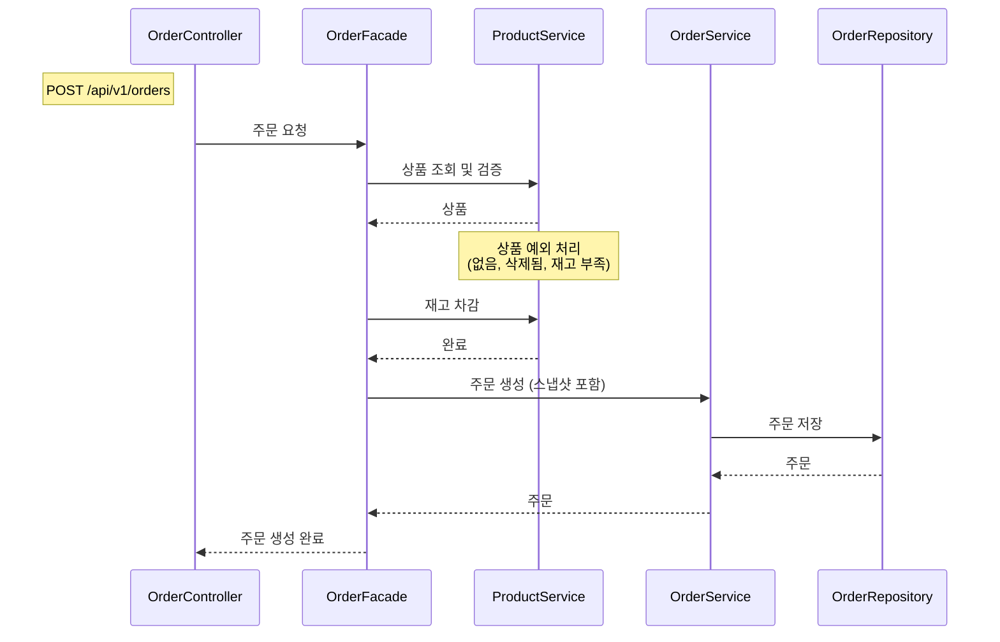
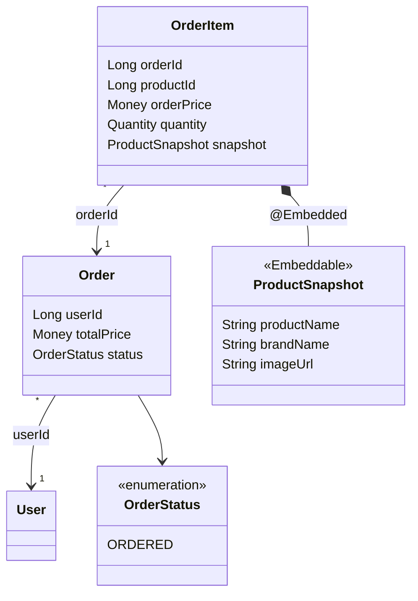
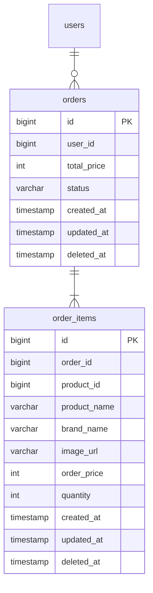

# Order 도메인 설계

> 공통 설계 원칙은 `_shared/CONVENTIONS.md` 참조

---

## 요구사항

> **회원으로서**, 여러 상품을 한 번에 주문할 수 있다.
> 주문 시 상품 재고가 확인되고 차감된다.
> 주문 후에도 당시 상품 정보(가격, 이름 등)를 확인할 수 있다.
>
> **관리자로서**, 전체 주문 내역을 조회할 수 있다.

### 예외 및 정책

- **재고 확인 + 차감 원자적 처리** — 재고 확인과 차감은 하나의 트랜잭션 안에서 원자적으로 수행. 일괄 처리 방식(IN 쿼리).
- **스냅샷 저장** — 주문 시점의 상품 정보(상품명, 가격, 브랜드명)를 OrderItem에 복사. 이후 상품이 변경/삭제되어도 주문 내역은 보존.
- **재고 부족 시 주문 전체 실패** — 하나의 상품이라도 재고 부족이면 주문 전체가 롤백. 부분 성공 없음.
- **items 비어있으면 실패** — 주문 항목이 없는 요청은 거부.
- **동시성 이슈** — 추후 비관적 락 또는 낙관적 락으로 해결 예정.
- **가격 변동 검증** — 주문 시점에 클라이언트가 보낸 expectedPrice와 Product의 현재 가격을 비교. 불일치 시 주문 실패 ("가격이 변경되었습니다"). 하이패션 고가 상품의 가격 분쟁 방지.
- **두 가지 주문 경로** — 바로구매(상품 페이지에서 직접)와 장바구니 주문. Order 도메인은 출처를 모르고, Facade가 경로를 조율. 주문 로직은 단일.
- **스냅샷 구조** — OrderItem에 @Embedded ProductSnapshot (productName, brandName, imageUrl 등). productId는 별도 유지 (재구매, 통계용, FK 아님).
- **Order ↔ OrderItem** — ID 참조 (orderId). @OneToMany 미사용. 같은 Aggregate이지만 프로젝트 전체 ID 참조 패턴과 일관성 유지.

### API

| 기능 | 액터 | Method | URI | 인증 |
|------|------|--------|-----|------|
| 주문 요청 | 회원 | POST | `/api/v1/orders` | O |
| 주문 목록 조회 | 회원 | GET | `/api/v1/orders?startAt={date}&endAt={date}` | O |
| 주문 상세 조회 | 회원 | GET | `/api/v1/orders/{orderId}` | O |
| 주문 목록 조회 | Admin | GET | `/api-admin/v1/orders?page=0&size=20` | LDAP |
| 주문 상세 조회 | Admin | GET | `/api-admin/v1/orders/{orderId}` | LDAP |

### 주문 요청 본문 예시

```json
{
  "items": [
    { "productId": 1, "quantity": 2, "expectedPrice": 50000 },
    { "productId": 3, "quantity": 1, "expectedPrice": 120000 }
  ]
}
```

---

## 유즈케이스

**UC-O01: 주문 요청**

```
[기능 흐름]
1. 회원이 상품 목록(productId, quantity, expectedPrice)으로 주문을 요청한다
2. 각 상품이 존재하는지 확인한다 (삭제된 상품 불가)
3. 각 상품의 expectedPrice와 현재 가격을 비교한다 (불일치 시 실패)
4. 각 상품의 재고가 충분한지 확인한다
5. 재고를 차감한다 (원자적 처리)
6. 주문 시점의 상품 정보를 스냅샷으로 저장한다 (ProductSnapshot: 상품명, 브랜드명, 이미지 등)
7. 주문을 생성한다

[예외]
- 상품이 존재하지 않거나 삭제된 경우 주문 실패
- expectedPrice와 현재 가격이 불일치하면 주문 실패
- 재고가 부족한 상품이 하나라도 있으면 주문 전체 실패
- items가 비어있으면 주문 실패

[조건]
- 로그인한 회원만 가능
- 바로구매/장바구니 주문 모두 같은 API 사용 (Order 도메인은 출처를 모름)
- 재고 확인과 차감은 원자적으로 처리되어야 함
- 동시성 이슈는 추후 해결 (비관적 락 또는 낙관적 락)
```

**UC-O02: 주문 목록 조회 (회원)**

```
[기능 흐름]
1. 회원이 기간(startAt, endAt)을 지정하여 주문 목록을 요청한다
2. 해당 기간 내 본인의 주문 목록을 반환한다

[조건]
- 본인의 주문만 조회 가능
- startAt, endAt은 필수값 (기간 지정 필수)
```

**UC-O03: 주문 상세 조회 (회원)**

```
[기능 흐름]
1. 회원이 orderId로 주문 상세를 요청한다
2. 해당 주문이 존재하는지 확인한다
3. 본인의 주문인지 확인한다
4. 주문 정보와 스냅샷된 상품 정보를 반환한다

[예외]
- orderId에 해당하는 주문이 없으면 404 반환
- 본인의 주문이 아니면 접근 불가

[조건]
- 본인의 주문만 조회 가능
- 상품 정보는 스냅샷 기준 (현재 상품 상태와 무관)
```

---

## 시퀀스 다이어그램: 주문 요청

> 주문은 **Product 도메인 (상품 검증 + 재고 차감) + Order 도메인 (주문 생성 + 스냅샷)**을 조율해야 하므로 Facade가 필요하다.



---

## 클래스 설계



### 비즈니스 규칙

| 엔티티 | 메서드 | 비즈니스 규칙 |
|---|---|---|
| OrderItem | createSnapshot(Product, int) | 정적 팩토리. 주문 시점 Product 정보를 ProductSnapshot으로 복사 |

### 관계 정리

| 관계 | 참조 방식 | 설명 |
|---|---|---|
| User → Order | ID 참조 (userId) | UserSnapshot 불필요 |
| Order → OrderItem | ID 참조 (orderId) | @OneToMany 미사용. 같은 Aggregate이지만 ID 참조 |
| OrderItem → ProductSnapshot | @Embedded | 주문 시점 상품 정보 스냅샷 |
| OrderItem.productId | ID 유지 (FK 아님) | 재구매, 통계 분석을 위한 데이터 연결용 |

---

## ERD



### 인덱스

| 인덱스 컬럼 | 용도 |
|---|---|
| orders (user_id, created_at) | 유저의 주문 목록 조회 (날짜 범위 필터링) |
| order_items.order_id | 주문의 상세 항목 조회 |

### 동시성 제어

| 대상 | 방식 | 이유 |
|---|---|---|
| products.stock | 비관적 락 (추후 확정) | 주문 시 재고 차감. 동시 주문에도 재고가 음수가 되어서는 안 된다 |

### 참조 무결성 검증 (애플리케이션 레벨)

- 주문 생성 시 — 모든 product_id가 유효하고, expectedPrice와 현재 가격이 일치하며, 재고가 충분한지 확인

### order_items.product_id 포함 이유

스냅샷은 **조회 편의용**이고, product_id는 **데이터 연결용**으로 역할이 다르다.

- 재구매 기능: "이 상품을 다시 구매" 시 원본 상품으로 이동
- 통계 분석: "어떤 상품이 얼마나 팔렸나" 집계 시 product_id 기준으로 GROUP BY
- FK가 아님: 상품이 삭제되어도 주문 내역은 스냅샷으로 보존
