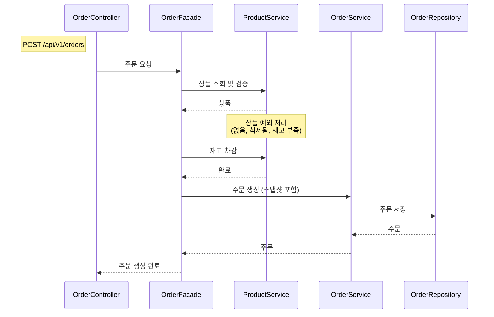
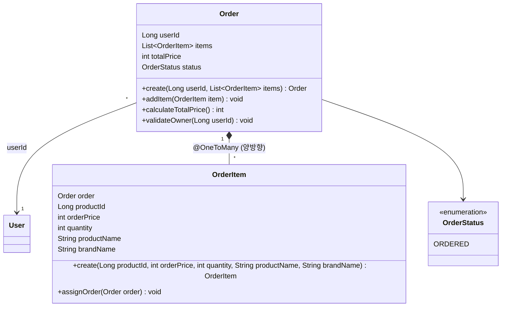
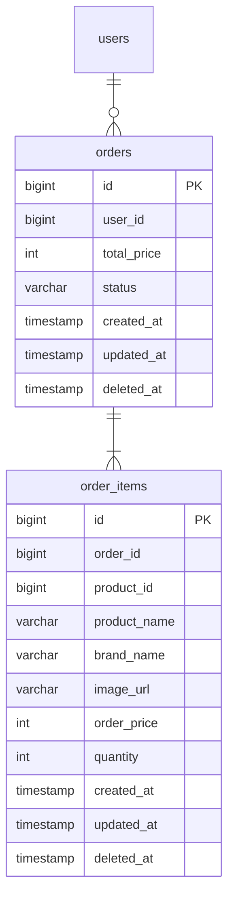

# Order 도메인 설계

> 공통 설계 원칙은 `_shared/CONVENTIONS.md` 참조

---

## 요구사항

> **회원으로서**, 여러 상품을 한 번에 주문할 수 있다.
> 주문 시 상품 재고가 확인되고 차감된다.
> 주문 후에도 당시 상품 정보(가격, 이름 등)를 확인할 수 있다.
>
> **관리자로서**, 전체 주문 내역을 조회할 수 있다.

### 예외 및 정책

- **재고 확인 + 차감 원자적 처리** — 재고 확인과 차감은 하나의 트랜잭션 안에서 원자적으로 수행. 일괄 처리 방식(IN 쿼리).
- **스냅샷 저장** — 주문 시점의 상품 정보(상품명, 가격, 브랜드명)를 OrderItem에 복사. 이후 상품이 변경/삭제되어도 주문 내역은 보존.
- **재고 부족 시 주문 전체 실패** — 하나의 상품이라도 재고 부족이면 주문 전체가 롤백. 부분 성공 없음.
- **items 비어있으면 실패** — 주문 항목이 없는 요청은 거부.
- **동시성 이슈** — 추후 비관적 락 또는 낙관적 락으로 해결 예정.
- **가격 변동 검증** — 주문 시점에 클라이언트가 보낸 expectedPrice와 Product의 현재 가격을 비교. 불일치 시 주문 실패 ("가격이 변경되었습니다"). 하이패션 고가 상품의 가격 분쟁 방지.
- **두 가지 주문 경로** — 바로구매(상품 페이지에서 직접)와 장바구니 주문. Order 도메인은 출처를 모르고, Facade가 경로를 조율. 주문 로직은 단일.
- **스냅샷 구조** — OrderItem에 직접 필드로 저장 (productName, brandName). 필드 3~4개 수준에서 별도 테이블 분리는 불필요. productId는 별도 유지 (재구매, 통계용, FK 아님). VO(@Embeddable)를 사용하지 않고 Entity 필드로 직접 관리.
- **Order ↔ OrderItem** — 양방향 `@OneToMany` / `@ManyToOne` 매핑. 같은 Aggregate 내부이므로 Aggregate Root(Order)가 OrderItem의 생명주기를 직접 관리한다.
  - `cascade = CascadeType.PERSIST` — Order 저장 시 OrderItem 함께 저장. REMOVE는 Soft Delete와 충돌하므로 미사용.
  - `orphanRemoval = false` — 주문 항목 제거 요구사항 없음 + Soft Delete 정책과 충돌 방지.
  - `@BatchSize(size = 100)` — LAZY 기본, 목록 조회 시 N+1 방지.
  - **totalPrice** — Order.create() 시점에 items로부터 직접 계산. 도메인 계산 로직은 도메인이 소유한다.
  - **OrderItemRepository 유지** — Aggregate Root 통한 접근은 생성/변경에 적용. 조회(통계, 배치, 검색)는 OrderItemRepository 직접 사용 허용.

### API

| 기능 | 액터 | Method | URI | 인증 |
|------|------|--------|-----|------|
| 주문 요청 | 회원 | POST | `/api/v1/orders` | O |
| 주문 목록 조회 | 회원 | GET | `/api/v1/orders?startAt={date}&endAt={date}` | O |
| 주문 상세 조회 | 회원 | GET | `/api/v1/orders/{orderId}` | O |
| 주문 목록 조회 | Admin | GET | `/api-admin/v1/orders?page=0&size=20` | LDAP |
| 주문 상세 조회 | Admin | GET | `/api-admin/v1/orders/{orderId}` | LDAP |

### 주문 요청 본문 예시

```json
{
  "items": [
    { "productId": 1, "quantity": 2, "expectedPrice": 50000 },
    { "productId": 3, "quantity": 1, "expectedPrice": 120000 }
  ]
}
```

---

## 유즈케이스

**UC-O01: 주문 요청**

```
[기능 흐름]
1. 회원이 상품 목록(productId, quantity, expectedPrice)으로 주문을 요청한다
2. 상품 ID 목록을 추출하여 IN절로 일괄 조회한다 (개별 루프 조회 금지)
3. 조회된 상품 수와 요청 상품 수가 일치하는지 확인한다 (삭제된 상품 불가)
4. 각 상품의 expectedPrice와 현재 가격을 비교한다 (불일치 시 실패)
5. 각 상품의 재고가 충분한지 확인하고 차감한다 (원자적 처리)
6. 주문 시점의 상품 정보를 스냅샷으로 저장한다 (ProductSnapshot: 상품명, 브랜드명, 이미지 등)
7. 주문을 생성한다

[예외]
- 상품이 존재하지 않거나 삭제된 경우 주문 실패
- expectedPrice와 현재 가격이 불일치하면 주문 실패
- 재고가 부족한 상품이 하나라도 있으면 주문 전체 실패
- items가 비어있으면 주문 실패

[조건]
- 로그인한 회원만 가능
- 바로구매/장바구니 주문 모두 같은 API 사용 (Order 도메인은 출처를 모름)
- 재고 확인과 차감은 원자적으로 처리되어야 함
- 동시성 이슈는 추후 해결 (비관적 락 또는 낙관적 락)
```

**UC-O02: 주문 목록 조회 (회원)**

```
[기능 흐름]
1. 회원이 기간(startAt, endAt)을 지정하여 주문 목록을 요청한다
2. 해당 기간 내 본인의 주문 목록을 반환한다

[조건]
- 본인의 주문만 조회 가능
- startAt, endAt은 필수값 (기간 지정 필수)
```

**UC-O03: 주문 상세 조회 (회원)**

```
[기능 흐름]
1. 회원이 orderId로 주문 상세를 요청한다
2. 해당 주문이 존재하는지 확인한다
3. 본인의 주문인지 확인한다
4. 주문 정보와 스냅샷된 상품 정보를 반환한다

[예외]
- orderId에 해당하는 주문이 없으면 404 반환
- 본인의 주문이 아니면 접근 불가

[조건]
- 본인의 주문만 조회 가능
- 상품 정보는 스냅샷 기준 (현재 상품 상태와 무관)
```

---

## 시퀀스 다이어그램: 주문 요청

> 주문은 **Product 도메인 (상품 검증 + 재고 차감) + Order 도메인 (주문 생성 + 스냅샷)**을 조율해야 하므로 Facade가 필요하다.


```mermaid
sequenceDiagram
    participant OC as OrderController
    participant OF as OrderFacade
    participant PS as ProductService
    participant OS as OrderService
    participant OR as OrderRepository

    Note left of OC: POST /api/v1/orders
    OC->>OF: 주문 요청
    OF->>PS: 상품 조회 및 검증
    PS-->>OF: 상품

    Note over PS: 상품 예외 처리<br/>(없음, 삭제됨, 재고 부족)

    OF->>PS: 재고 차감
    PS-->>OF: 완료

    OF->>OS: 주문 생성 (스냅샷 포함)
    OS->>OR: 주문 저장
    OR-->>OS: 주문
    OS-->>OF: 주문
    OF-->>OC: 주문 생성 완료
```

---

## 클래스 설계


```mermaid
classDiagram
    class Order {
        Long userId
        List~OrderItem~ items
        int totalPrice
        OrderStatus status
        +create(Long userId, List~OrderItem~ items) Order
        +addItem(OrderItem item) void
        +calculateTotalPrice() int
        +validateOwner(Long userId) void
    }

    class OrderItem {
        Order order
        Long productId
        int orderPrice
        int quantity
        String productName
        String brandName
        +create(Long productId, int orderPrice, int quantity, String productName, String brandName) OrderItem
        +assignOrder(Order order) void
    }

    class OrderStatus {
        <<enumeration>>
        ORDERED
    }

    Order "*" --> "1" User : userId
    Order "1" *-- "*" OrderItem : @OneToMany (양방향)
    Order --> OrderStatus
```

### 비즈니스 규칙

| 엔티티 | 메서드 | 비즈니스 규칙 |
|---|---|---|
| Order | create(userId, items) | 정적 팩토리. items를 받아 totalPrice를 직접 계산하고, 양방향 연관관계를 세팅 |
| Order | addItem(item) | 편의 메서드. items 컬렉션에 추가 + item.assignOrder(this)로 양방향 동기화 |
| Order | calculateTotalPrice() | items의 orderPrice × quantity 합산 |
| OrderItem | create(productId, orderPrice, quantity, productName, brandName) | 정적 팩토리. 주문 시점 상품 정보를 직접 필드로 저장. orderId 불필요 (연관관계로 관리) |
| OrderItem | assignOrder(order) | Order 참조 세팅. Order.addItem()에서 호출 |

### 관계 정리

| 관계 | 참조 방식 | 설명 |
|---|---|---|
| User → Order | ID 참조 (userId) | UserSnapshot 불필요 |
| Order ↔ OrderItem | 양방향 `@OneToMany` / `@ManyToOne` | 같은 Aggregate. cascade=PERSIST, orphanRemoval=false, @BatchSize(100) |
| OrderItem 스냅샷 필드 | 직접 필드 (productName, brandName) | 주문 시점 상품 정보를 Entity 필드로 직접 저장 |
| OrderItem.productId | ID 유지 (FK 아님) | 재구매, 통계 분석을 위한 데이터 연결용 |

---

## ERD


```mermaid
erDiagram
    orders {
        bigint id PK
        bigint user_id
        int total_price
        varchar status
        timestamp created_at
        timestamp updated_at
        timestamp deleted_at
    }

    order_items {
        bigint id PK
        bigint order_id
        bigint product_id
        varchar product_name
        varchar brand_name
        varchar image_url
        int order_price
        int quantity
        timestamp created_at
        timestamp updated_at
        timestamp deleted_at
    }

    users ||--o{ orders : ""
    orders ||--|{ order_items : ""
```

### 인덱스

| 인덱스 컬럼 | 용도 |
|---|---|
| orders (user_id, created_at) | 유저의 주문 목록 조회 (날짜 범위 필터링) |
| order_items.order_id | 주문의 상세 항목 조회 |

### 동시성 제어

| 대상 | 방식 | 이유 |
|---|---|---|
| products.stock | 비관적 락 (추후 확정) | 주문 시 재고 차감. 동시 주문에도 재고가 음수가 되어서는 안 된다 |

### 참조 무결성 검증 (애플리케이션 레벨)

- 주문 생성 시 — 모든 product_id가 유효하고, expectedPrice와 현재 가격이 일치하며, 재고가 충분한지 확인

### order_items.product_id 포함 이유

스냅샷은 **조회 편의용**이고, product_id는 **데이터 연결용**으로 역할이 다르다.

- 재구매 기능: "이 상품을 다시 구매" 시 원본 상품으로 이동
- 통계 분석: "어떤 상품이 얼마나 팔렸나" 집계 시 product_id 기준으로 GROUP BY
- FK가 아님: 상품이 삭제되어도 주문 내역은 스냅샷으로 보존
