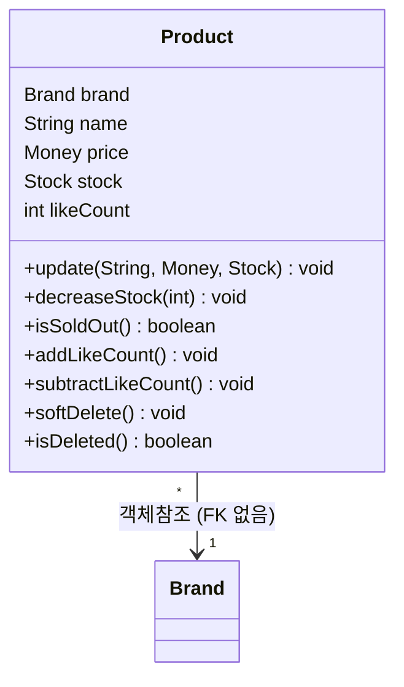
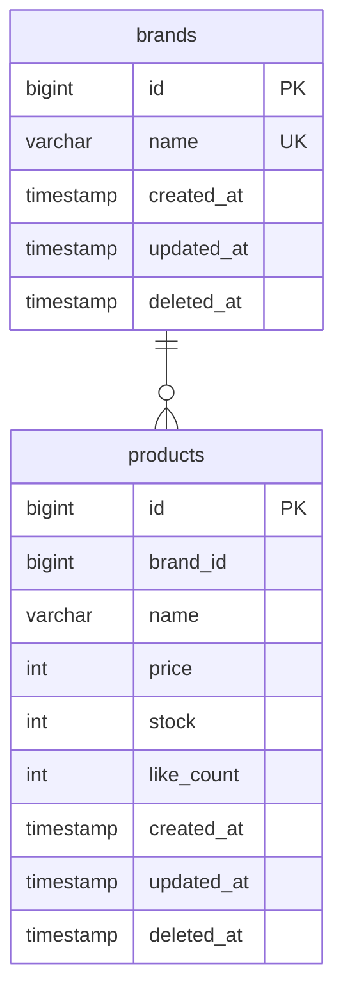

# Product 도메인 설계

> 공통 설계 원칙은 `_shared/CONVENTIONS.md` 참조

---

## 요구사항

> **비회원으로서**, 상품 목록을 둘러보고 상세 정보를 확인할 수 있다.
> **관리자로서**, 상품을 등록/수정/삭제하여 판매 상품을 관리할 수 있다.

### 예외 및 정책

- **Soft Delete** — `deleted_at` 컬럼으로 논리 삭제
- **재고: Product 필드로 관리** — 별도 Stock 도메인 분리 없이 Product 엔티티의 stock 필드로 관리. 등록/수정 시 재고 설정, 주문 시 차감.
- **고객 vs Admin 응답 차이** — 고객에게는 기본 정보만, Admin에게는 관리 정보 추가 제공
- **soft delete된 상품** — 고객 조회 불가 (404 반환)
- **Brand → Product 참조** — 객체참조 + FK 없음. `@ManyToOne` + `ConstraintMode.NO_CONSTRAINT`. `product.getBrand().getName()` 접근 가능.
- **Product.likeCount 캐시 필드** — 찜 수 조회 성능을 위해 Product에 likeCount 캐싱. 찜/취소 시 원자적 증감.
- **독립 Aggregate Root** — Brand와 Product는 별도 Aggregate Root.

### API

| 기능 | 액터 | Method | URI | 인증 |
|------|------|--------|-----|------|
| 상품 목록 조회 | 비회원/회원 | GET | `/api/v1/products` | X |
| 상품 정보 조회 | 비회원/회원 | GET | `/api/v1/products/{productId}` | X |
| 상품 목록 조회 | Admin | GET | `/api-admin/v1/products?page=0&size=20&brandId={brandId}` | LDAP |
| 상품 상세 조회 | Admin | GET | `/api-admin/v1/products/{productId}` | LDAP |
| 상품 등록 | Admin | POST | `/api-admin/v1/products` | LDAP |
| 상품 정보 수정 | Admin | PUT | `/api-admin/v1/products/{productId}` | LDAP |
| 상품 삭제 | Admin | DELETE | `/api-admin/v1/products/{productId}` | LDAP |

### 상품 목록 조회 쿼리 파라미터

| 파라미터 | 설명 | 기본값 |
|----------|------|--------|
| `brandId` | 특정 브랜드 상품 필터링 | - (선택) |
| `sort` | 정렬 기준: `latest` / `price_asc` / `likes_desc` | `latest` |
| `page` | 페이지 번호 | 0 |
| `size` | 페이지당 상품 수 | 20 |

> `likes_desc` 정렬 시 좋아요 수는 Product.likeCount 필드로 정렬.

---

## 유즈케이스

**UC-P01: 상품 목록 조회 (비회원)**

```
[기능 흐름]
1. 비회원이 상품 목록을 요청한다 (선택: brandId, sort, page, size)
2. soft delete된 상품/브랜드를 제외한다
3. 정렬 조건에 맞게 정렬한다
4. 페이지네이션하여 상품 목록을 반환한다
5. 각 상품의 좋아요 수를 Product.likeCount로 함께 반환한다

[대안 흐름]
- brandId가 없으면 전체 상품 조회
- sort가 없으면 latest(최신순) 기본 적용
```

**UC-P02: 상품 정보 조회 (비회원)**

```
[기능 흐름]
1. 비회원이 productId로 상품 정보를 요청한다
2. 해당 상품이 존재하는지 확인한다
3. 상품 정보와 함께 좋아요 수(Product.likeCount)를 반환한다

[예외]
- productId에 해당하는 상품이 없거나 삭제된 경우 404 반환
```

**UC-P03: 상품 등록 (Admin)**

```
[기능 흐름]
1. Admin이 상품 정보를 입력한다 (brandId, 상품명, 가격, 재고 등)
2. brandId에 해당하는 브랜드가 존재하는지 확인한다
3. 상품을 저장한다
4. 생성된 상품 정보를 반환한다

[예외]
- brandId에 해당하는 브랜드가 없거나 삭제된 경우 등록 실패

[조건]
- 상품의 브랜드는 반드시 이미 등록된(삭제되지 않은) 브랜드여야 함
- 재고(stock)는 상품 등록 시 초기값 설정 (0 이상)
```

**UC-P04: 상품 정보 수정 (Admin)**

```
[기능 흐름]
1. Admin이 productId와 수정할 정보를 요청한다
2. 해당 상품이 존재하는지 확인한다
3. 상품 정보를 업데이트한다

[예외]
- productId에 해당하는 상품이 없거나 삭제된 경우 404 반환

[조건]
- 상품의 브랜드(brandId)는 수정할 수 없음
- 재고(stock) 수정 가능
```

**UC-P05: 상품 삭제 (Admin)**

```
[기능 흐름]
1. Admin이 productId로 삭제를 요청한다
2. 해당 상품이 존재하는지 확인한다
3. 해당 상품을 soft delete 한다

[예외]
- productId에 해당하는 상품이 없거나 이미 삭제된 경우 404 반환
```

---

## 클래스 설계



### Value Object

| VO | 검증/행위 | 비즈니스 규칙 |
|---|---|---|
| Money | validate() | 0 이상이어야 함 |
| Stock | validate() | 0 이상이어야 함 |
| Stock | deduct(quantity) | 재고 부족 시 CoreException(BAD_REQUEST) |
| Stock | hasEnough(quantity) | 재고가 요청 수량 이상인지 확인 |

### 비즈니스 규칙

| 메서드 | 비즈니스 규칙 |
|---|---|
| decreaseStock(int) | 재고 부족 시 CoreException(BAD_REQUEST). Stock VO에 위임 |
| isSoldOut() | stock이 0인지 확인. "품절"의 정의를 캡슐화 |
| addLikeCount() / subtractLikeCount() | 찜 등록/취소 시 likeCount 원자적 증감 |
| softDelete() / isDeleted() | deleted_at 설정 |

---

## ERD



### 인덱스

| 인덱스 컬럼 | 용도 |
|---|---|
| products.brand_id | 브랜드별 상품 필터링, 브랜드 삭제 시 연쇄 soft delete |

### 동시성 제어

| 대상 | 방식 | 이유 |
|---|---|---|
| products.stock | 비관적 락 (추후 확정) | 주문 시 재고 차감. 동시 주문에도 재고가 음수가 되어서는 안 된다 |
| products.like_count | 원자적 UPDATE (`SET like_count = like_count + 1`) | 경합이 심하지 않으므로 비관적 락은 과도함 |
