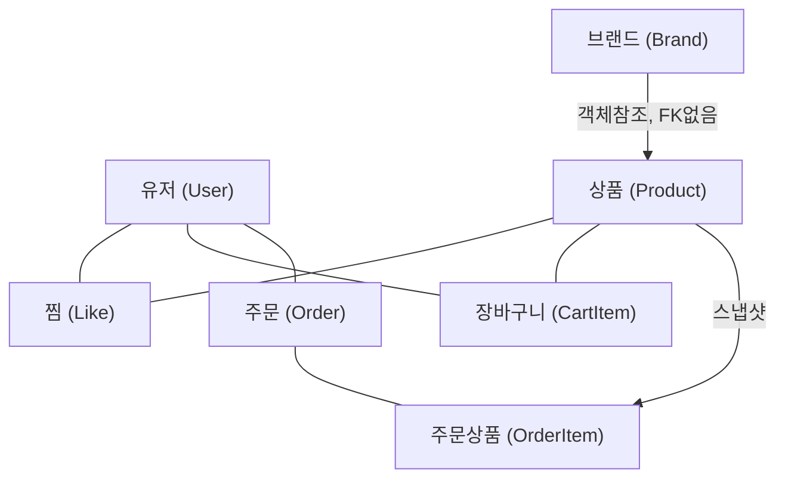
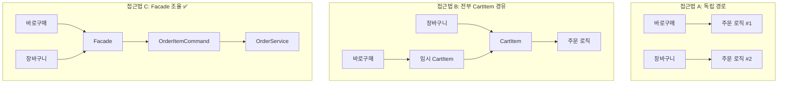
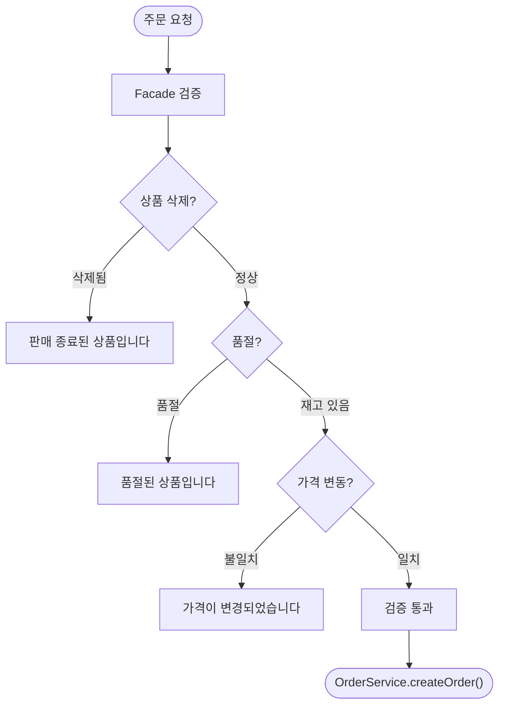
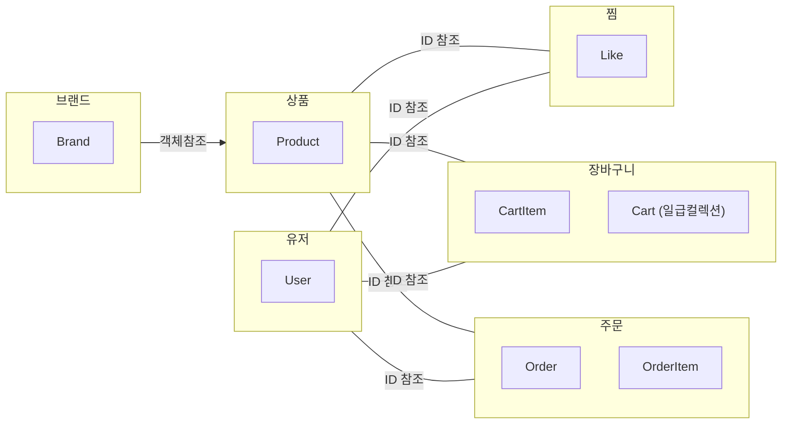
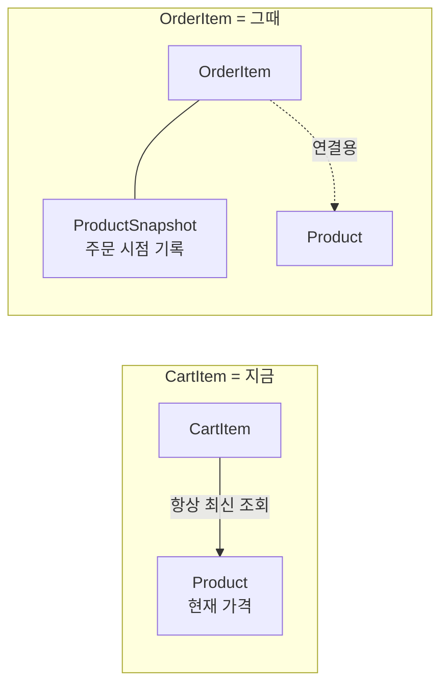
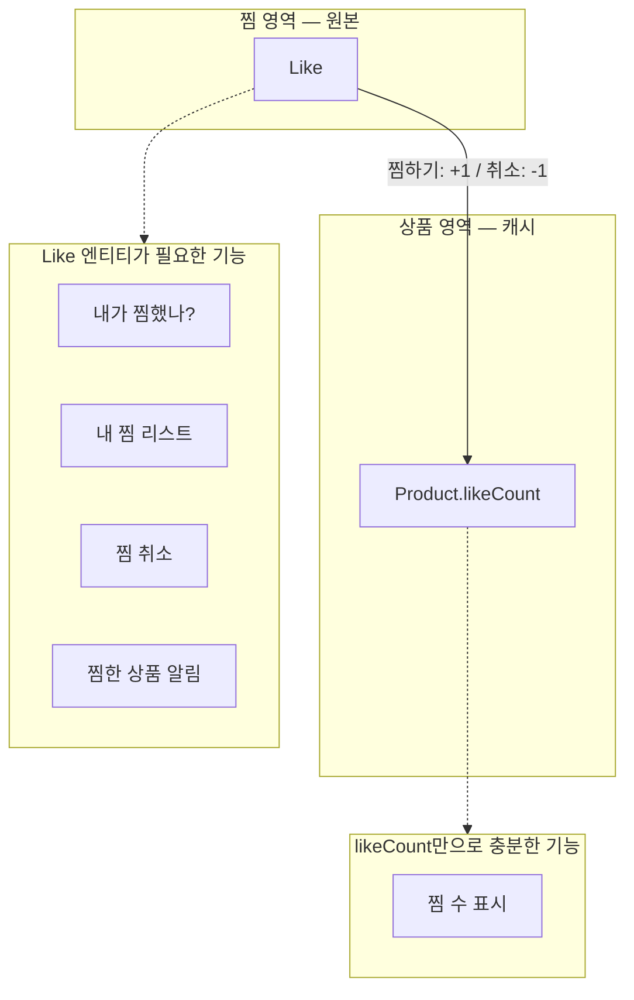

# 하이패션 이커머스 도메인 관계 설계 — 의사결정 기록

> 기술적 사고력이란, Trade-Off를 내 상황에 맞게 실무 관점에서 생각하고 결정하는 것이다.
> 이 글은 하이패션 이커머스 프로젝트의 도메인 관계를 설계하면서 어떤 고민을 했고, 어떤 선택지가 있었고, 왜 그렇게 결정했는지를 기록한 것이다.

---

## 프로젝트 맥락

SSENSE와 같은 하이패션 이커머스 플랫폼을 설계하고 있다. 관리자가 브랜드의 상품을 올리는 구조이며, 고가 브랜드를 다루기 때문에 소비자들이 신중하게 구매하고, 장바구니에 상품이 많이 담기지 않는 특성이 있다. 현재 샵이나 카테고리는 없지만 나중에 추가할 수 있다.

초기 도메인은 Brand, Product, Order, Like, CartItem으로 시작했고, 이 관계들을 하나씩 구체화해나갔다.

## 최종 도메인 관계 — 먼저 결론부터

이 글에서 다루는 모든 고민의 최종 결과다. 왜 이렇게 됐는지는 이후의 Part 1~3에서 하나씩 따라가면 된다.



```
모든 영역 간 참조는 ID 참조 (Brand → Product만 객체참조 + FK 없음)
Cart ↔ Order 사이에 직접 관계 없음 (Facade가 조율)
삭제 전략은 기본적으로 SoftDelete
DB FK 제약 사용하지 않음, 무결성은 애플리케이션에서 보장
DB 유니크 제약은 사용 (테이블 내부 제약, FK와 성격이 다름)
```

---

# Part 1. 주문 흐름 설계

> **이 파트에서 다루는 것**: 상품이 장바구니에 담기고, 주문으로 이어지는 흐름을 설계한다. Cart 엔티티가 정말 필요한지, 주문 경로가 2개인 게 맞는지, 품절/삭제/가격 변동을 어떻게 검증할지를 결정한다.

## 1-1. Cart 엔티티가 필요한가?

### 상황

User와 CartItem을 연결하는 방식을 설계하면서, "현실 세계에 장바구니라는 개념이 있으니까 Cart 엔티티를 만들어야 하는 거 아닌가?"라는 의문이 들었다.

### 스스로에게 던진 질문들

**"장바구니 단위로 어떤 행위를 하고 싶은가?"** — 딱히 없었다. 장바구니라는 현실 개념이 있으니까 고민이 된 것이지, Cart 엔티티가 해야 할 구체적인 행위가 떠오르지 않았다. 이 시점에서 이미 경고 신호였다.

**"장바구니에서 주문할 때, 전체를 주문하나? 선택한 항목만?"** — 둘 다 지원해야 한다. 그런데 이건 Cart 엔티티 유무와 관계없이 가능하다. 전체 주문은 `WHERE user_id = ?`로, 선택 주문은 `WHERE id IN (?)`로 CartItem을 조회하면 된다. 이건 요청 파라미터의 문제이지 도메인 모델의 문제가 아니다.

**"한 유저가 여러 장바구니를 가질 수 있나?"** — 없다. 1인 1장바구니다. 이게 결정적이었다. User : Cart가 1:1이면, Cart의 식별자는 사실상 userId와 동일하다. 별도의 cartId가 존재할 이유가 없다. 만약 1:N이었다면 (위시리스트, "나중에 살 것" 등) Cart에 이름이나 타입 같은 고유 속성이 생기니까 엔티티가 정당화되지만, 1:1에서는 그냥 User의 연장선이다.

### 선택지

| | User → CartItem 직접 | User → Cart → CartItem |
|---|---|---|
| 구조 | CartItem에 userId만 | Cart 엔티티 + CartItem |
| Cart 고유 상태 | 없음 | 만료일, 쿠폰, 공유 URL 등 가능 |
| Cart 고유 행위 | 없음 | 잠금, 만료 등 가능 |
| 복잡도 | 낮음 | 중간 |

Cart 엔티티가 정당화되려면 장바구니 만료일(30일 후 자동 비우기), 장바구니 단위 쿠폰 적용 상태, 장바구니 공유 기능(공유 URL 생성), 장바구니 잠금(결제 진행 중 변경 방지) 같은 것이 필요하다. 현재 이런 요구사항이 없다.

- **내 상황에서의 판단**: "N개의 상품을 담는다"는 Cart의 고유한 역할이 아니라 CartItem 집합의 성질이다. `SELECT * FROM cart_item WHERE user_id = ?` 한 줄로 "이 유저의 장바구니"가 완성된다.

### 결정: User → CartItem 직접 + Cart는 일급 컬렉션으로

DB 엔티티로서의 Cart는 만들지 않되, 코드에서 **일급 컬렉션(First-Class Collection)**으로 Cart 객체를 둔다.

```java
public class Cart {
    private final List<CartItem> items;

    public Cart(List<CartItem> items) {
        this.items = items;
    }

    public int getTotalPrice() { ... }
    public int getItemCount() { ... }
    public List<CartItem> selectItems(List<Long> cartItemIds) { ... }
}
```

이렇게 하면 "장바구니 전체 가격 계산", "선택한 항목만 추출" 같은 장바구니 단위 행위를 Cart 객체 안에 응집시킬 수 있다. 테이블은 없으니 불필요한 엔티티 없이, 장바구니라는 현실 개념을 코드에서 표현하는 절충안이다.

> **이 결정에서 얻은 것**: "현실의 개념 = 엔티티"가 아니다. "도메인에서 고유한 상태와 행위가 있는 개념 = 엔티티"다.

---

## 1-2. 주문 경로가 2개인 문제

### 상황

이 프로젝트에서 가장 깊이 고민한 설계 결정이다.

주문으로 이어지는 경로가 두 가지다. "상품 페이지에서 바로구매"와 "장바구니에서 주문". 그런데 정말 2가지 경로가 필요한 것인지 의심이 들었다. 주문할 때 Product가 CartItem으로 담기는 구조라면, 결국 모든 주문이 CartItem을 거치는 것 아닌가?

### 스스로에게 던진 질문들

**"주문의 진짜 원천은 뭐지?"** — CartItem은 Product를 "담아둔 포인터"일 뿐이다. 장바구니 주문이든 바로구매든, 결국 주문에 필요한 정보(상품, 가격, 재고)는 Product가 가지고 있다. 그러면 "모든 주문은 결국 Product를 거친다"고 볼 수 있지 않을까?

**"CartItem에 가격을 저장해야 하나?"** — 하이패션에서 시즌 세일이 핵심 구매 패턴이다. CartItem에 담은 시점 가격을 저장하면, 세일이 시작돼도 장바구니에 정가가 보인다. 유저가 빼고 다시 담아야 세일 가격이 적용되는 최악의 UX가 된다. **가격의 원천(source of truth)은 항상 Product여야 한다.**

**"그러면 CartItem은 뭐지?"** — CartItem은 `productId + quantity`만 가지는 포인터다.

### 선택지

**접근법 A: 두 개의 독립 경로.** 바로구매는 Product → Order 직접, 장바구니 주문은 CartItem → Order로 별도 로직.

- 장점: 바로구매 시 CartItem을 만들 필요 없음, 각 경로 독립 최적화 가능
- 단점: 주문 생성 로직이 두 벌, 쿠폰/할인 추가 시 양쪽 다 수정 필요
- **내 상황에서의 판단**: 쿠폰/할인 기능을 계획하고 있기 때문에, 주문 로직이 두 벌이면 유지보수 비용이 배로 늘어난다. **탈락.**

**접근법 B: 모든 주문이 CartItem을 거침.** 바로구매를 눌러도 내부적으로 임시 CartItem 생성 → 주문 → CartItem 삭제. 항상 단일 흐름.

- 장점: 주문 로직이 하나, 쿠폰/할인 한 곳에서 관리
- 단점: 바로구매 시 임시 CartItem이 생기는 게 도메인적으로 부자연스러움. CartItem은 "담아두기"라는 의미인데, 바로구매하는 사람은 "담아둔" 적이 없음
- **내 상황에서의 판단**: 하이패션 특성상 고가 상품이라 바로구매 비율이 높을 수 있다. 매번 임시 CartItem을 만들었다 지우는 건 의미적으로도, 데이터적으로도 낭비다.

**접근법 C: Cart와 Order가 서로를 모르는 구조.** 핵심 발상의 전환 — OrderItem 입장에서 자기가 장바구니에서 왔는지, 바로구매에서 왔는지는 전혀 중요하지 않다. Order 도메인은 "어떤 상품을, 몇 개, 얼마에"만 알면 된다.

```
// 핵심 원칙: OrderService는 출처를 모른다
OrderService.createOrder(userId, List<OrderItemCommand> items, CouponInfo coupon)

// Facade에서 분기
바로구매 → OrderItemCommand 직접 생성 → OrderService 호출
장바구니 → CartItem 조회 → OrderItemCommand 변환 → OrderService 호출 → CartItem 삭제
```

- 장점: 도메인 간 결합도 최소, 주문 로직 단일화, Cart를 나중에 완전히 바꿔도 Order에 영향 없음
- 단점: Facade 계층을 잘 설계해야 함
- **내 상황에서의 판단**: Facade 패턴은 현재 프로젝트에서 이미 사용하고 있는 구조여서 추가 비용이 크지 않다.

**접근법 D: "모든 주문은 Product를 거친다"는 관점.** 접근법 C를 한 단계 더 구체화한다.

- 바로구매: Product → Order
- 장바구니 주문: CartItem → **Product** → Order

CartItem은 Product를 가리키는 포인터일 뿐이고, 주문의 진짜 원천은 항상 Product다. 이 관점이 C에서 Facade가 `OrderItemCommand(productId, quantity, price)`를 만들 때 **price를 어디서 가져오느냐**를 확정해준다 — 항상 Product에서 가져온다.

### 결정: 접근법 C + Product 중심 원칙



"2가지 경로"라는 문제의 해결책은 "경로를 하나로 합치는 것(B)"이 아니라, **"Order 도메인이 경로를 신경 쓰지 않게 만드는 것(C)"**이었다.

이 결정의 핵심 근거:

1. **쿠폰/할인 계획이 있다** → 주문 로직이 단일해야 유지보수 가능 (A 탈락)
2. **하이패션 특성상 바로구매 비율이 높을 수 있다** → 임시 CartItem 강제는 비효율 (B 약점)
3. **DDD 관점에서 Cart와 Order는 서로 다른 Bounded Context** → 직접 의존 없는 것이 자연스러움 (C의 강점)
4. **Facade 패턴을 이미 사용 중** → C의 조율 비용이 추가 부담이 아님
5. **하이패션은 시즌 세일이 핵심 패턴** → 가격의 원천은 항상 Product (D의 보강)

---

## 1-3. 품절, 삭제, 가격 변동 — 주문 시점에 무엇을 검증해야 하는가?

### 상황

1-2에서 "가격의 원천은 항상 Product"라는 원칙을 세웠다. 그런데 이 원칙을 따르면, 장바구니에 담긴 상품의 상태가 바뀌었을 때 어떻게 처리해야 하는지라는 문제가 자연스럽게 따라온다.

### 스스로에게 던진 질문들

#### "CartItem이 가격을 저장하는 이커머스는 어떤 상황인가?"

이 질문은 "왜 최신 가격이 맞는지"를 반대 사례로 검증하기 위해 던졌다.

CartItem에 가격을 저장하는 대표적인 사례는 B2B 이커머스(고객별 협상 가격)나 타임세일/플래시딜("지금 담으면 이 가격 보장") 같은 비즈니스 규칙이 있는 경우다. 하이패션에서는 고객별 차등 가격이 없고, "담으면 가격 보장" 정책도 없다. 오히려 시즌 세일 시 장바구니에 담아둔 상품 가격이 자동으로 바뀌어야 자연스러운 UX다.

#### "장바구니에 담긴 상품이 품절되면?"

하이패션에서 한정 수량이 많으니 이건 빈번한 시나리오다.

**선택지:**
1. 품절되면 장바구니에서 자동 제거
2. 품절 표시하고 유저가 직접 제거
3. 품절 표시 + 재입고 시 알림

**결정: 품절 표시하고 유저가 직접 제거.** 자동 제거는 유저 입장에서 "내가 담아둔 게 사라졌다"는 혼란을 준다. 하이패션에서 비싼 상품을 신중하게 골라 담았는데 자동으로 없어지면 불쾌하다.

#### "상품이 아예 삭제(SoftDelete)되면?"

시즌이 끝나면 상품 자체가 내려가는 경우다.

**선택지:**
1. 판매 종료 표시 + 주문 불가
2. 장바구니에서 자동 제거
3. 일정 기간 후 자동 제거

**결정: 판매 종료 표시 + 주문 불가.** 품절은 재입고 가능성이 있지만, 삭제된 상품은 돌아오지 않는다. SoftDelete의 가치가 여기서 드러난다 — HardDelete였으면 CartItem이 참조하는 Product가 사라져서 FK 제약 위반이 되지만, SoftDelete이면 Product 데이터는 남아있으니 "판매 종료" 표시가 가능하다.

#### "장바구니에 품절 상품이 섞여있을 때 주문하면?"

**선택지:**
1. 품절 상품 포함 시 주문 전체 차단
2. 품절 상품만 빼고 나머지만 주문 가능
3. 유저에게 선택하게

**결정: 품절 상품 포함 시 주문 전체 차단.** 하이패션에서 유저는 "전체 코디를 맞춰서 사는" 패턴이 강하다. 자켓 + 팬츠를 함께 담았는데 팬츠만 빠진 채로 주문되면 오히려 불만이다.

#### "품절 차단을 어느 시점에 하는가?"

**결정: 장바구니 화면에서 미리 차단 + 백엔드 이중 검증.** 프론트에서 주문 버튼을 비활성화하는 건 UX 가이드일 뿐이다. 유저가 장바구니 화면을 보는 시점과 주문 버튼을 누르는 시점 사이에 시간차가 있고, 그 사이에 품절될 수 있다. **프론트는 UX를 위한 가이드이고, 백엔드가 실제 안전장치다.**

#### "결제 직전에 가격이 바뀌는 동시성 문제는?"

이게 가장 실무적으로 중요한 문제다. 유저가 장바구니 화면에서 50만원을 보고 주문 버튼을 눌렀는데, 그 사이 관리자가 가격을 변경했다면?

**결정: 주문 시점에 유저가 본 가격(expectedPrice)과 Product의 현재 가격을 비교해서, 다르면 주문을 막는다.** 하이패션에서 고가 상품이라 가격 차이가 크기 때문에, 일반 이커머스에서 100원 차이는 무시할 수 있지만 여기서 50,000원 차이는 분쟁이 된다.

#### "가격 변동 시 유저에게 알림을 줘야 하나?"

**결정: 지금은 아니지만, 설계에 영향을 주지 않게 분리한다.** 알림은 CartItem의 책임이 아니라 알림 도메인의 책임이다. Product 가격이 바뀌면 이벤트를 발행하고, 해당 Product를 CartItem에 담고 있는 유저들에게 알림을 보내는 이벤트 기반 구조로 나중에 추가할 수 있다. 중요한 건 이 기능 때문에 CartItem에 price 필드를 넣을 필요가 없다는 점이다.

### Facade 검증 흐름 — 세 가지가 한 곳에서 수렴

위 질문들의 결론을 종합하면, 주문 생성 직전에 Facade가 해야 할 검증이 하나로 모인다.



```java
// Facade에서 주문 생성 전 검증 흐름
for (OrderItemCommand item : items) {
    Product product = productService.findById(item.getProductId());

    // 1. 상품 삭제 여부
    if (product.isDeleted()) → "판매 종료된 상품입니다" 에러

    // 2. 품절 여부
    if (product.isSoldOut()) → "품절된 상품입니다" 에러

    // 3. 가격 변동 여부
    if (product.getPrice() != item.getExpectedPrice()) → "가격이 변경되었습니다" 에러
}

// 모든 검증 통과 시에만 주문 생성
orderService.createOrder(userId, validatedItems);
```

상품 삭제, 품절, 가격 변동 — 이 세 가지 검증이 모두 같은 시점(주문 생성 직전)에, 같은 위치(Facade)에서 일어난다. Order 도메인은 이 검증을 몰라도 된다.

### Part 1에서 세운 원칙

> - **가격의 원천은 항상 Product** — CartItem은 가격을 저장하지 않는다
> - **Cart와 Order는 서로를 모른다** — Facade가 경로를 조율하고, Order 도메인은 출처를 모른다
> - **Facade가 안전한 주문만 통과시키는 게이트** — 품절/삭제/가격 검증은 Facade에서 수렴

---

# Part 2. 도메인 경계 설계

> **이 파트에서 다루는 것**: Part 1에서 주문 흐름을 설계했으니, 이제 도메인을 어떤 영역으로 나누고, 영역 간에 어떻게 연결하며, Aggregate 경계를 어디에 두는지를 결정한다.

## 2-1. 도메인 영역은 어떻게 나누는가?

### 상황

도메인 관계가 구체화되면서, "이 도메인들을 어떤 영역(Bounded Context)으로 묶을 것인가?"라는 질문이 자연스럽게 떠올랐다. 처음에는 "상품 영역에 Brand, Product, Like, CartItem이 있고, 주문 영역에 Order가 있다"고 생각했다.

### 영역 판단 기준의 발전

이 고민을 풀면서 **영역을 나누는 기준 자체가 3단계로 발전**했다. 처음에 세운 기준이 반례에 부딪히면서 더 정교한 기준으로 진화한 과정이 핵심이다.

#### 첫 번째 기준: 생명주기 종속 → 실패

"Like의 생명주기가 Product에 종속되니까 상품 영역"이라고 판단했다. Product가 삭제되면 Like도 존재 이유가 없으니까.

하지만 CartItem도 Product가 삭제되면 "판매 종료"가 되는데, Part 1에서 CartItem은 독자적인 품절/가격 검증 규칙이 있어서 독립 영역이 맞다고 결정했다. **생명주기 종속만으로는 영역을 결정할 수 없었다.**

#### 두 번째 기준: 독자적 행위 유무 → 필요하지만 불충분

Like의 행위를 구체적으로 나열해보니:

- Like한 상품이 품절/삭제 시 유저 알림 필요
- 상품의 인기수에 반영 (Product 방향)
- 유저의 찜 리스트 조회 (User 방향)

분명히 독자적 행위가 있었다. 만약 Like가 Product 하위 도메인이면, "마이페이지 찜 리스트"를 조회할 때 ProductService에 `findLikedProductsByUserId` 같은 메서드가 생긴다. Product 도메인이 User의 찜 행위까지 책임지게 되는 것이다.

**→ Like도 독립 영역.**

하지만 이 기준만으로는 "그러면 Like와 CartItem을 하나로 묶을 수 있는가?"에 답할 수 없었다. 둘 다 독자적 행위가 있으니까.

#### 세 번째 기준: "함께 변경되는가" → 결정적

Like와 CartItem을 나란히 비교해봤다.

| | Like | CartItem |
|---|---|---|
| 구조 | userId + productId | userId + productId + quantity |
| Order와 관계 | 없음 | Facade 통해 주문으로 변환 |
| 변경 빈도 | 낮음 (한번 찜하면 유지) | 높음 (수량 변경, 추가/제거) |

구조가 비슷하니까 "유저 활동 영역"으로 묶을 수 있지 않을까? 하지만 핵심 차이는 **CartItem은 주문 흐름에 참여하고, Like는 참여하지 않는다**는 것이다. CartItem의 품절/가격 검증 로직이 변경될 때 Like 쪽 코드는 건드릴 필요가 없다.

"구조가 비슷하다"는 묶는 이유가 안 된다. **"함께 변경되는가"**가 영역을 나누는 진짜 기준이다.

#### 세 기준의 발전 과정 정리

| 기준 | 내용 | 한계 |
|---|---|---|
| ① 생명주기 종속 | "Product 삭제 시 같이 사라지면 같은 영역" | CartItem도 종속인데 독립 영역 → 반례 |
| ② 독자적 행위 유무 | "자기만의 비즈니스 규칙이 있으면 독립" | Like, CartItem 둘 다 있음 → 묶을지 판단 불가 |
| ③ 함께 변경되는가 | "한쪽 로직이 바뀔 때 다른쪽도 바꿔야 하면 같은 영역" | **결정적 기준** |

기준 ①이 실패해서 ②로, ②가 부족해서 ③으로 발전한 것이지, 처음부터 ③을 알고 있었던 건 아니다.

### 결정: 6개 독립 영역



실선 화살표(→)는 같은 도메인 내 객체 참조, 실선(─)은 영역 간 ID 참조다.

- **브랜드 영역**: Brand
- **상품 영역**: Product
- **찜 영역**: Like
- **장바구니 영역**: CartItem (+ 일급 컬렉션 Cart)
- **주문 영역**: Order, OrderItem
- **유저 영역**: User

---

## 2-2. Brand ↔ Product — 참조 방식, Aggregate 경계, 패키지 구조

### 상황

Brand 1:N Product 관계에서, Brand가 삭제되면 해당 Product도 전부 판매 중단하기로 결정했고, Product는 반드시 Brand에 속해야 한다. 이 결정들이 참조 방식과 Aggregate 경계에 어떤 영향을 주는지 따져봐야 했다.

### 스스로에게 던진 질문들

#### "JPA에서 참조 방식이 뭐가 있고, 뭘 써야 하나?"

멘토님이 "JPA에서는 키(인덱스, 유니크키, 외래키)에 대한 기능을 직접적으로 사용하지 않습니다"라고 했는데, 정확히 어떤 방식인지 몰랐다. 알고 보니 세 가지 방식이 있었다.

**방식 1: 객체 참조 + DB FK 제약.** `@ManyToOne` + `@JoinColumn`으로 DB에 FK 제약조건이 생긴다.

**방식 2: ID 참조.** `private Long brandId`로 ID만 가진다. Brand 정보가 필요하면 별도로 조회해야 한다.

**방식 3: 객체 참조 + FK 없음.** `@ManyToOne` + `@JoinColumn(foreignKey = @ForeignKey(ConstraintMode.NO_CONSTRAINT))`로 코드에서는 객체 참조를 쓰지만 DB에는 FK 제약을 안 만든다.

| | 방식 1 (객체 + FK) | 방식 2 (ID만) | 방식 3 (객체 + FK없음) |
|---|---|---|---|
| 코드 접근 | `product.getBrand()` | `brandService.findById(brandId)` | `product.getBrand()` |
| DB FK 제약 | 있음 | 없음 | 없음 |
| 무결성 보장 | DB가 보장 | 앱이 보장 | 앱이 보장 |
| 결합도 | DB + 코드 둘 다 | 완전 분리 | 코드만 결합 |
| 데드락 위험 | FK 잠금 전파 | 없음 | 없음 |

- **내 상황에서의 판단**: Brand와 Product는 같은 상품 도메인이고, `product.getBrand().getName()` 같은 접근이 빈번하다. 방식 2(ID만)는 매번 별도 조회가 필요해서 번거롭다. 방식 1(FK)은 데드락 위험과 결합도가 문제다. 방식 3은 코드 편의성과 DB 유연성의 절충안이다.

#### "데드락 가능성은?"

FK 제약이 있으면 Product를 INSERT/UPDATE할 때 DB가 Brand 행에 공유 잠금을 건다. 같은 Brand의 상품을 여러 트랜잭션이 동시에 수정하면 데드락이 가능하다. 하이패션에서 시즌 세일 때 한 브랜드의 상품 가격을 일괄 변경하는 상황을 생각하면 현실적 위험이다. FK가 없는 방식 3에서는 이 위험이 사라진다.

#### "Brand와 Product의 Aggregate 경계는?"

| | Brand가 Root + Product 하위 | 각각 독립 Root |
|---|---|---|
| Brand 조회 시 | Product 전부 로딩 | Brand만 로딩 |
| Product 수정 시 | Brand Aggregate 잠금 | Product만 잠금 |
| 동시성 | 같은 Brand 상품 동시 수정 어려움 | 자유로움 |
| Brand 삭제 → Product | Aggregate 내부 자동 처리 | Facade에서 조율 필요 |

- **내 상황에서의 판단**: 하이패션에서 브랜드당 상품이 100개 이상일 수 있다. Brand를 조회할 때마다 Product 100개가 로딩되고, 시즌 세일 때 같은 브랜드의 상품을 동시에 수정하면 충돌이 생긴다. Aggregate 내부 자동 처리라는 편의보다 성능과 동시성이 더 중요하다.

#### "패키지 구조는?"

**접근 A: 영역별 완전 분리.** brand/, product/, like/, cart/, order/, user/ 각각 독립 패키지.
**접근 B: 핵심 도메인 그룹핑.** product/ 안에 brand, like 등을 서브패키지로.

- **내 상황에서의 판단**: 2-1에서 6개 독립 영역으로 결정했다. 패키지 구조가 이 결정을 반영해야 한다. "브랜드를 검색했는데 상품이 없을 수도 있다"는 점을 생각하면, Brand가 Product 하위 패키지에 있으면 Brand 조회가 상품 영역의 하위 기능처럼 보인다. **접근 A 채택.**

### 결정

- **참조 방식**: 방식 3 (객체 참조 + FK 없음)
- **Aggregate 경계**: 각각 독립 Aggregate Root
- **패키지 구조**: 영역별 완전 분리

> **이 결정에서 얻은 것**: 참조 방식은 "편하냐"가 아니라 "FK가 주는 제약(데드락, 결합도)을 감수할 수 있느냐"로, Aggregate 경계는 "같은 영역이냐"가 아니라 "같은 트랜잭션에서 다뤄져야 하느냐"로 판단해야 한다.

---

## 2-3. Product ↔ OrderItem — 주문 내역과 스냅샷

### 상황

CartItem은 "아직 안 산 것"이지만 OrderItem은 "이미 산 것"이다. 이 차이가 설계에 큰 영향을 준다. 핵심 질문은 "주문된 상품이 나중에 삭제되면, 과거 주문 내역은 어떻게 되는가?"였다.

### 스스로에게 던진 질문들

#### "Product가 삭제된 후에도 주문 내역에서 상품 정보를 보여줘야 하나?"

**결정: 주문 시 스냅샷을 같이 생성한다.** Part 1의 "가격의 원천은 Product" 원칙과 연결된다. 주문 시점에 Product에서 최신 정보를 가져와서 OrderItem에 스냅샷으로 찍는다.

여기서 **CartItem과 OrderItem의 스냅샷 필요성 차이**가 명확해진다.



| | CartItem | OrderItem |
|---|---|---|
| 성격 | "아직 안 산 것" | "이미 산 것" |
| 필요한 정보 | 항상 최신 (세일 가격 반영) | 주문 시점 기록 보존 |
| 스냅샷 | **불필요** | **필수** |

같은 Product 정보를 참조하지만 "시간의 관점"이 다르다. CartItem은 "지금"이 중요하고, OrderItem은 "그때"가 중요하다.

#### "OrderItem에서 productId를 계속 가지고 있어야 하나?"

스냅샷이 있으면 productId 없이도 주문 내역을 보여줄 수 있다. 하지만 "이 상품을 다시 구매" 기능이나 "어떤 상품이 얼마나 팔렸나" 통계 분석에 productId가 필요하다.

**결정: productId 유지.** 스냅샷은 조회 편의용이고, productId는 데이터 연결용으로 역할이 다르다.

#### "스냅샷을 어떤 구조로 저장할 것인가?"

| | 접근 1: 직접 넣기 | 접근 2: @Embedded | 접근 3: 별도 테이블 |
|---|---|---|---|
| DB | OrderItem 테이블 하나 | OrderItem 테이블 하나 | OrderItem + Snapshot 2개 |
| 코드 | 필드 뒤섞임 | **역할별 분리** | 완전 분리 |
| 스냅샷 필드 추가 시 | OrderItem이 비대해짐 | **ProductSnapshot만 수정** | JOIN 필요 |

- **내 상황에서의 판단**: 하이패션 상품은 스냅샷할 정보가 많을 수 있다(상품명, 브랜드명, 이미지, 사이즈, 컬러, 소재 등). 접근 1이면 OrderItem 필드가 비대해지고, 접근 3은 항상 같이 생성/조회되는 데이터를 굳이 테이블로 나누는 과도한 분리다.

### 결정: @Embedded로 분리

```java
@Entity
public class OrderItem {
    private Long orderId;
    private Long productId;       // 데이터 연결용 (재구매, 통계)
    private int quantity;
    private int orderPrice;

    @Embedded
    private ProductSnapshot snapshot;  // 조회 편의용
}

@Embeddable
public class ProductSnapshot {
    private String productName;
    private String brandName;
    private String imageUrl;
}
```

### Part 2에서 세운 원칙

> - **영역을 나누는 기준은 "함께 변경되는가"** — 생명주기 종속이나 구조 유사성이 아니라, 변경 이유가 같은가
> - **FK는 편의가 아니라 제약** — 데드락, 결합도, 삭제 순서 문제를 감수할 수 있을 때만
> - **같은 데이터라도 역할이 다르면 분리** — productId(연결), orderPrice(기록), ProductSnapshot(조회)

---

# Part 3. 나머지 관계 확정

> **이 파트에서 다루는 것**: Part 1~2에서 핵심 구조와 원칙을 세웠다. 이제 남은 관계들(User ↔ Order, User ↔ Like, User ↔ CartItem, Product ↔ Like, Product ↔ CartItem, Order ↔ OrderItem)에 같은 원칙을 적용해서 일괄 확정한다.

## 3-1. User ↔ Order

### "참조 방식은?"

다른 영역이므로 ID 참조가 원칙이다. 하지만 "Order에서 User 정보가 자주 필요하면 방식 3(객체 참조)이 편하지 않을까?"라는 의문이 있었다.

이걸 판단하려면 **"주문 내역을 누가 조회하는가?"**부터 따져야 한다. 유저 본인만 자기 주문을 본다. 관리자 화면은 현재 범위에 없다. 그러면 Order 도메인 로직에서 User 객체가 필요한 순간이 없다.

- **내 상황에서의 판단**: Brand ↔ Product에서 방식 3을 택한 건 "같은 상품 도메인이고 `product.getBrand().getName()`이 빈번하기 때문"이었는데, User ↔ Order에는 그런 이유가 없다. **ID 참조.**

### "UserSnapshot이 필요한가?"

| | ProductSnapshot | UserSnapshot |
|---|---|---|
| 삭제 후 조회 상황 | 유저가 "뭘 샀는지" 봄 | 탈퇴한 유저는 로그인 불가 → 조회 자체가 없음 |
| 스냅샷 필요성 | **필수** | **불필요** |

- **내 상황에서의 판단**: ProductSnapshot이 필요한 이유는 "상품이 삭제돼도 유저가 주문 내역에서 뭘 샀는지 봐야 하기 때문"이다. UserSnapshot은? 유저 본인이 탈퇴하면 조회 주체 자체가 사라진다. 보여줄 대상이 없다.

### 결정

- 참조 방식: ID 참조 (userId만)
- UserSnapshot: 불필요
- User 탈퇴 시: 주문 데이터 DB 유지 (비즈니스 기록)
- 주문 취소만 지원 (반품은 나중에 추가)

---

## 3-2. User ↔ Like, User ↔ CartItem

### User ↔ Like

Like 도메인 로직에서 `like.getUser().getName()` 같은 호출이 필요한 시점이 없다. **ID 참조.**

User 탈퇴 시 Like 데이터를 유지할 이유도 없다. 탈퇴한 유저의 찜은 허수 데이터일 뿐이다. 삭제하면 상품의 찜 수(likeCount)도 줄어드는데, 이것이 맞다 — 실제로 활동하는 유저의 찜만 의미 있는 수치다.

### User ↔ CartItem + 동시성 문제

CartItem도 같은 논리로 **ID 참조.**

여기서 중요한 설계 결정이 나왔다. **"동일 상품을 장바구니에 또 담으면?"** → 수량 +1로 결정했는데, 이건 `userId + productId` 조합이 유일해야 한다는 뜻이다.

#### "유니크 보장을 어디서 할 것인가?"

애플리케이션에서만 보장하면 동시성 문제가 생긴다. 같은 상품에 "장바구니 담기" 버튼을 빠르게 두 번 클릭하면, 두 요청이 동시에 "CartItem 없음"을 확인하고 둘 다 INSERT해서 중복 데이터가 생긴다.

| | 비관적 락 | 분산 락 | DB 유니크 제약 |
|---|---|---|---|
| 경합 빈도 낮을 때 | 과도함 | 과도함 | **적절** |
| 정합성 보장 | 확실 | Redis 정상 시 | **확실** |
| 인프라 추가 | 없음 | Redis 필요 | **없음** |
| 코드 복잡도 | 중간 (잠금 범위 관리) | 높음 (락 타임아웃, 갱신) | **낮음** (예외 처리만) |

- **내 상황에서의 판단**: 하이패션에서 장바구니 담기의 동시성 경합은 "더블클릭" 수준이지, 쿠팡 타임세일처럼 수만 명이 동시에 담는 상황이 아니다. 경합 빈도는 매우 낮지만, 발생하면 반드시 막아야 한다(중복 CartItem → 주문 시 같은 상품이 OrderItem 2개로 생김). Redis 인프라도 없다. **DB 유니크 제약이 가장 합리적인 비용으로 가장 확실한 보장을 준다.**

비관적 락이나 분산 락은 "수만 명이 동시에 같은 자원을 경합하는 상황"에서 빛을 발한다. 예를 들어 한정판 스니커즈 100개를 1만 명이 동시에 주문하는 시나리오 — 이건 재고 차감의 동시성 문제이고, 장바구니 중복 방지와는 다른 문제다.

#### "멘토님이 키를 안 쓴다고 했는데, 유니크 제약도 해당되나?"

FK와 유니크 제약은 같은 "키"라는 이름이지만 성격이 다르다.

| | FK (외래키) | 유니크 제약 |
|---|---|---|
| 제약 범위 | **테이블 간** (Product → Brand) | **테이블 내부** (CartItem 자체) |
| 다른 테이블 영향 | 있음 (잠금 전파, 삭제 순서) | **없음** |
| 데드락 위험 | 있음 | **없음** |

멘토님이 피하려는 건 FK의 **테이블 간 결합**이지, 테이블 내부 제약까지 포함한 게 아니다.

### 결정

| | User ↔ Like | User ↔ CartItem |
|---|---|---|
| 참조 방식 | ID 참조 (userId) | ID 참조 (userId, productId) |
| 유니크 제약 | userId + productId | userId + productId |
| User 탈퇴 시 | 삭제 + likeCount 감소 | 삭제 |

---

## 3-3. Product ↔ Like — likeCount 집계 방식

### "인기수를 어떻게 집계할 것인가?"

상품 상세, 상품 목록, 브랜드별 상품, 검색 결과 — 상품이 나오는 모든 곳에서 찜 수가 표현돼야 한다.

| 기준 | COUNT (조회 시 집계) | likeCount 캐시 (Product 필드) |
|---|---|---|
| 데이터 정합성 | ✅ 항상 정확 | 관리 필요 (탈퇴/삭제 시 동기화) |
| 조회 성능 | 모든 API에 서브쿼리 | ✅ Product만 읽으면 끝 |
| 영역 간 결합도 | ✅ 완전 독립 | Like → Product 단방향 결합 |
| 동시성 | - | `likeCount + 1` 원자적 처리 |

처음에는 "영역 결합도"를 중시해서 COUNT 방식을 선호했다. 하지만 결합의 실체를 따져보니 — **원자적 UPDATE 한 줄(`SET likeCount = likeCount + 1`)이 전부**다. 이 정도 결합으로 모든 조회 API가 깔끔해진다면?

- **내 상황에서의 판단**: 영역 결합은 원칙이고, 조회 편의성은 매일 마주치는 현실이다. 원칙을 어기는 대가가 UPDATE 한 줄이고, 지키는 대가가 모든 상품 조회 API의 서브쿼리라면, **충분히 합리적인 타협**이다.

### "likeCount가 있으면 Like 엔티티가 필요 없지 않나?"

| 기능 | likeCount만으로 가능? | Like 엔티티 필요? |
|---|---|---|
| "이 상품 찜 수" 표시 | ✅ | - |
| "내가 이 상품을 찜했나?" | ❌ | ✅ |
| "내 찜 리스트" 조회 | ❌ | ✅ |
| "찜 취소" | ❌ | ✅ |
| "찜한 상품 세일 알림" | ❌ | ✅ |

**likeCount는 Like 데이터의 파생값(derived data)**이다. Like 엔티티가 원본이고 likeCount는 조회 성능을 위한 캐시다.



### 결정

- 참조 방식: ID 참조 (productId만)
- 유니크 제약: DB 유니크 (`userId + productId`)
- 인기수 집계: Product에 likeCount 캐시 (원자적 증감)
- Like 엔티티 유지 (원본 데이터)
- Product 삭제 시: Like 삭제

---

## 3-4. Product ↔ CartItem

Part 1-3에서 품절/삭제 시 처리 규칙은 다뤘다. 참조 방식과 스냅샷 여부만 확정하면 된다.

Part 2-3에서 정리한 대비가 여기서도 적용된다 — **CartItem은 "아직 안 산 것"이라 항상 Product의 최신 정보를 보여줘야 한다.** 하이패션에서 시즌 세일이 시작되면 장바구니에 담아둔 상품의 세일 가격이 바로 반영돼야 한다.

### 결정

- 참조 방식: ID 참조 (productId만)
- 스냅샷: 불필요 (장바구니 조회 시 항상 Product에서 현재 정보 조회)

---

## 3-5. Order ↔ OrderItem — @OneToMany vs ID 참조

### 상황

같은 주문 영역이고 같은 Aggregate(Order가 Root)다. 같은 Aggregate이면 `@OneToMany + Cascade`가 자연스러운 선택인데, 정말 그래야 하나?

### Trade-Off

| | @OneToMany + Cascade | ID 참조 + Service 관리 |
|---|---|---|
| Aggregate 보장 | JPA 자동 (cascade, orphanRemoval) | Service 수동 (@Transactional) |
| 조회 | `order.getOrderItems()` | `orderItemRepository.findByOrderId()` |
| 예측 가능성 | JPA 내부 동작에 의존 | **쿼리가 명시적** |
| N+1 위험 | 있음 (LAZY 로딩 시) | **없음** |
| 프로젝트 일관성 | 이 관계만 다른 패턴 | **전체 ID 참조와 동일** |

`orderItem.getOrder()`가 필요한 상황을 점검했는데, OrderItem을 조회하는 상황은 항상 "주문 #123의 상품 목록" 같이 **Order를 먼저 알고 있는 상황**이다. 역추적이 필요 없으니 객체 참조의 실질적 이점이 없다.

- **내 상황에서의 판단**: 세 가지 이유로 ID 참조. 첫째, 프로젝트 전체가 ID 참조 패턴이므로 **일관성**. 한 군데만 `@OneToMany`를 쓰면 코드를 읽을 때 "여기는 왜 이 방식이지?"라는 의문이 생긴다. 둘째, 멘토님의 JPA 암묵적 동작 지양 방침과의 **정합성**. 셋째, `orderItem.getOrder()`가 필요한 상황이 없으므로 **잃는 게 없음**.

### 결정

- 참조 방식: ID 참조 (orderId만)
- Aggregate 규칙: Service에서 관리 (@Transactional로 함께 생성/삭제 보장)
- @OneToMany 사용하지 않음

### Part 3에서 도출된 판단 프레임워크

> 모든 관계를 따져보니 네 가지 질문으로 참조 방식을 판단할 수 있었다.
>
> 1. **"도메인 로직에서 상대 객체가 필요한가?"** — 필요 없으면 ID 참조
> 2. **"삭제 시 데이터를 유지해야 하는가?"** — 유지 필요하면 스냅샷 검토
> 3. **"동시성으로 데이터가 깨질 수 있는가?"** — 유니크 필요하면 DB 제약
> 4. **"프로젝트 전체와 일관적인가?"** — 일관성이 예측 가능성을 높인다

---

## 돌아보며

도메인 관계를 설계할 때, 가장 먼저 "정답"을 찾으려 했다. 하지만 실제로 중요했던 것은 **내 상황을 정확히 파악하는 것**이었다.

"하이패션이라 장바구니에 많이 안 담긴다", "바로구매 비율이 높을 수 있다", "쿠폰/할인이 나중에 들어온다", "시즌 세일이 핵심 구매 패턴이다" — 이런 맥락이 선택지의 장단점 무게를 완전히 바꿨다. 같은 접근법이라도 쿠팡 같은 대량 구매 이커머스였다면 다른 결정을 내렸을 것이다.

그리고 하나의 좋은 질문이 연쇄적으로 다음 질문을 낳았다. "주문 경로가 2개인 게 맞나?"라는 의심이 "가격의 원천은 어디인가?"로, 그리고 "품절/삭제/가격 변동을 어떻게 검증하는가?"로 자연스럽게 이어졌다. 영역을 나누다 보니 "Like는 정말 상품 영역인가?"라는 의문이 생겼고, 참조 방식을 결정하다 보니 "데드락은?"이라는 질문이 Aggregate 경계 결정으로 이어졌다.

기술적 의사결정은 "가장 좋은 방법"을 고르는 게 아니라, "내 상황에서 가장 합리적인 타협"을 찾는 과정이다. 그리고 그 과정에서 **스스로에게 좋은 질문을 던지는 것**이 생각하는 힘의 핵심이다.
