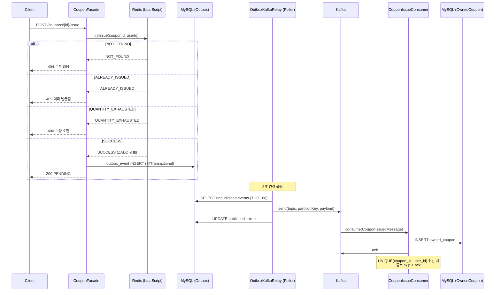

# 선착순 쿠폰 발급 아키텍처

## 전체 흐름

```
Client → Controller → CouponFacade → Redis(Lua) → Outbox(DB) → Poller → Kafka → Consumer → DB
```

### 시퀀스 다이어그램



---

## 컴포넌트별 역할과 핵심 코드

### 1. Redis Lua Script — 1차 문지기 (수량 + 중복 체크)

단일 Lua 스크립트로 **수량 확인, 중복 확인, 발급 기록**을 원자적으로 수행한다.
DB에 도달하기 전에 대부분의 무효 요청을 걸러낸다.

```lua
-- coupon-issue.lua
local issuedKey = KEYS[1]      -- coupon:issued:{couponId} (ZSET)
local quantityKey = KEYS[2]    -- coupon:totalQuantity:{couponId} (STRING)
local userId = ARGV[1]
local timestamp = tonumber(ARGV[2])

-- 쿠폰 존재 확인
local totalQuantity = tonumber(redis.call('GET', quantityKey))
if not totalQuantity then
    return 'NOT_FOUND'
end

-- 중복 발급 확인 (ZSET에 userId가 있으면 이미 발급됨)
if redis.call('ZSCORE', issuedKey, userId) then
    return 'ALREADY_ISSUED'
end

-- 수량 확인 (ZSET의 크기 = 발급된 수)
if redis.call('ZCARD', issuedKey) >= totalQuantity then
    return 'QUANTITY_EXHAUSTED'
end

-- 발급 기록 (score = timestamp)
redis.call('ZADD', issuedKey, timestamp, userId)
return 'SUCCESS'
```

**Redis 키 구조:**

| 키 | 타입 | 용도 |
|---|---|---|
| `coupon:totalQuantity:{couponId}` | STRING | 총 발급 수량 |
| `coupon:issued:{couponId}` | ZSET | 발급된 userId (score = timestamp) |

### 2. CouponRedisIssueLimiter — Redis 래퍼

Lua 스크립트를 실행하고 결과를 `CouponIssueResult` enum으로 변환한다.

```java
@Component
public class CouponRedisIssueLimiter implements CouponIssueLimiter {

    private static final String ISSUED_KEY_PREFIX = "coupon:issued:";
    private static final String QUANTITY_KEY_PREFIX = "coupon:totalQuantity:";

    public CouponIssueResult tryIssue(Long couponId, Long userId) {
        String result = redisTemplate.execute(
                issueScript,
                List.of(ISSUED_KEY_PREFIX + couponId, QUANTITY_KEY_PREFIX + couponId),
                String.valueOf(userId),
                String.valueOf(System.currentTimeMillis()));
        return CouponIssueResult.valueOf(result);
    }

    public void rollback(Long couponId, Long userId) {
        redisTemplate.opsForZSet().remove(
                ISSUED_KEY_PREFIX + couponId, String.valueOf(userId));
    }

    public void registerTotalQuantity(Long couponId, int totalQuantity) {
        redisTemplate.delete(ISSUED_KEY_PREFIX + couponId);  // 이전 발급 기록 초기화
        redisTemplate.opsForValue().set(
                QUANTITY_KEY_PREFIX + couponId, String.valueOf(totalQuantity));
    }
}
```

### 3. CouponFacade — 오케스트레이션

Redis 문지기 통과 후 Outbox 테이블에 이벤트를 저장한다.
`@Transactional`로 Outbox INSERT의 원자성을 보장한다.

```java
@Transactional
public CouponResult.IssuedDetail issueCoupon(Long couponId, Long userId) {
    // 1차 문지기: Redis Lua (수량 + 중복)
    CouponIssueResult result = couponIssueLimiter.tryIssue(couponId, userId);
    if (result == CouponIssueResult.NOT_FOUND) {
        throw new CoreException(CouponErrorCode.NOT_FOUND);
    }
    if (result == CouponIssueResult.ALREADY_ISSUED) {
        throw new CoreException(CouponErrorCode.ALREADY_ISSUED);
    }
    if (result == CouponIssueResult.QUANTITY_EXHAUSTED) {
        throw new CoreException(CouponErrorCode.QUANTITY_EXHAUSTED);
    }

    // Outbox에 이벤트 저장 (트랜잭션 내)
    try {
        outboxEventPublisher.publish(
                "COUPON_ISSUED",
                KafkaTopics.COUPON_ISSUED,
                String.valueOf(couponId),
                new CouponIssuedMessage(couponId, userId, System.currentTimeMillis()));
        return CouponResult.IssuedDetail.pending(couponId, userId);
    } catch (Exception e) {
        couponIssueLimiter.rollback(couponId, userId);
        throw e;
    }
}
```

### 4. Transactional Outbox — 이벤트 저장소

Kafka 발행의 신뢰성을 보장하는 중간 저장소. 이벤트를 DB 트랜잭션과 함께 저장하고,
별도 폴러가 비동기로 Kafka에 발행한다.

```java
// OutboxEventPublisher — JSON 직렬화 + outbox INSERT 캡슐화
@Component
public class OutboxEventPublisher {

    private final OutboxEventJpaRepository outboxRepository;
    private final ObjectMapper objectMapper;

    public void publish(String eventType, String topic, String partitionKey, Object payload) {
        outboxRepository.save(new OutboxEventEntity(
                UUID.randomUUID().toString(),
                eventType, topic, partitionKey,
                objectMapper.writeValueAsString(payload)));
    }
}
```

```java
// OutboxKafkaRelay — 3초 간격 폴링 + Kafka 발행
@Scheduled(fixedDelay = 3000)
@Transactional
public void relay() {
    List<OutboxEventEntity> events =
            outboxRepository.findTop100ByPublishedFalseOrderByCreatedAtAsc();

    for (OutboxEventEntity event : events) {
        kafkaTemplate.send(event.getTopic(), event.getPartitionKey(), event.getPayload())
                .get();  // 동기 대기 — 발행 보장
        event.markPublished();
    }
}
```

**Outbox 테이블 구조:**

| 컬럼 | 타입 | 설명 |
|---|---|---|
| `id` | BIGINT (PK) | Auto Increment |
| `event_id` | VARCHAR(100) | UUID |
| `event_type` | VARCHAR(100) | COUPON_ISSUED |
| `topic` | VARCHAR(100) | coupon-issued |
| `partition_key` | VARCHAR(100) | couponId |
| `payload` | TEXT | JSON |
| `published` | BOOLEAN | 발행 완료 여부 |
| `created_at` | DATETIME | 생성 시각 |
| `published_at` | DATETIME | 발행 시각 |

**인덱스:** `idx_outbox_published(published, created_at)` — 미발행 이벤트 조회 최적화

### 5. CouponIssueConsumer — Kafka 컨슈머

Outbox Relay가 발행한 메시지를 소비하여 실제 DB에 쿠폰을 INSERT한다.
UNIQUE 제약 위반(중복 발급) 시 skip 처리한다.

```java
@KafkaListener(
        topics = KafkaTopics.COUPON_ISSUED,
        groupId = "coupon-issue-consumer",
        containerFactory = KafkaConfig.SINGLE_LISTENER)
public void consume(@Payload CouponIssuedMessage message, Acknowledgment ack) {
    try {
        couponService.issue(message.couponId(), message.userId());
        ack.acknowledge();
    } catch (DataIntegrityViolationException e) {
        log.warn("중복 발급 메시지 skip: couponId={}, userId={}",
                message.couponId(), message.userId());
        ack.acknowledge();  // 중복은 정상 처리로 간주
    }
}
```

---

## 안전장치 요약

| 계층 | 체크 항목 | 방식 |
|---|---|---|
| **Redis** | 수량 초과 방지 | `ZCARD >= totalQuantity` |
| **Redis** | 중복 발급 방지 | `ZSCORE` 존재 여부 |
| **Outbox** | 메시지 유실 방지 | DB 트랜잭션 + 폴링 재시도 |
| **DB** | 최종 중복 방지 | `UNIQUE(coupon_id, user_id)` 제약 |
| **Consumer** | 중복 메시지 처리 | `DataIntegrityViolationException` catch + ack |

---

## 설계 결정과 Trade-off

### Redis ZSET을 선택한 이유

- **수량 확인 + 중복 확인 + 발급 기록**을 단일 자료구조로 해결
- `ZCARD` = 발급 수, `ZSCORE` = 중복 확인, `ZADD` = 발급 기록
- score에 timestamp를 기록하여 발급 순서 추적 가능

### 직접 Kafka 발행 대신 Outbox를 선택한 이유

| | 직접 Kafka 발행 | Outbox Pattern |
|---|---|---|
| **신뢰성** | Kafka 장애 시 메시지 유실 가능 | DB에 저장 → 재시도 보장 |
| **원자성** | Redis 성공 + Kafka 실패 = 불일치 | Redis 성공 + DB 저장 = 원자적 |
| **지연** | 즉시 | 최대 3초 (폴링 간격) |
| **복잡도** | 낮음 | 중간 (outbox 테이블 + 폴러) |

### StringSerializer 전용 KafkaTemplate을 분리한 이유

기본 Producer는 `JsonSerializer`를 사용한다. Outbox payload는 이미 JSON 문자열이므로
`JsonSerializer`로 보내면 **이중 직렬화** 문제가 발생한다.
Outbox 전용 `KafkaTemplate<String, String>`(StringSerializer)을 분리하여 해결했다.
